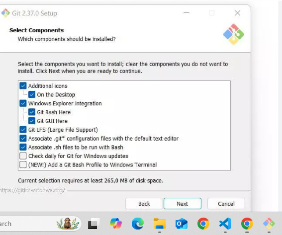
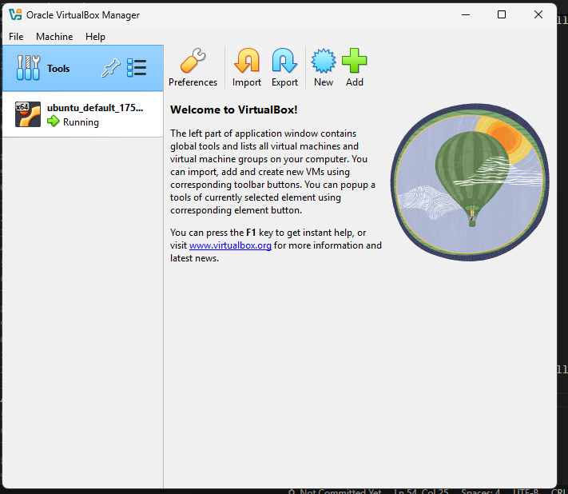
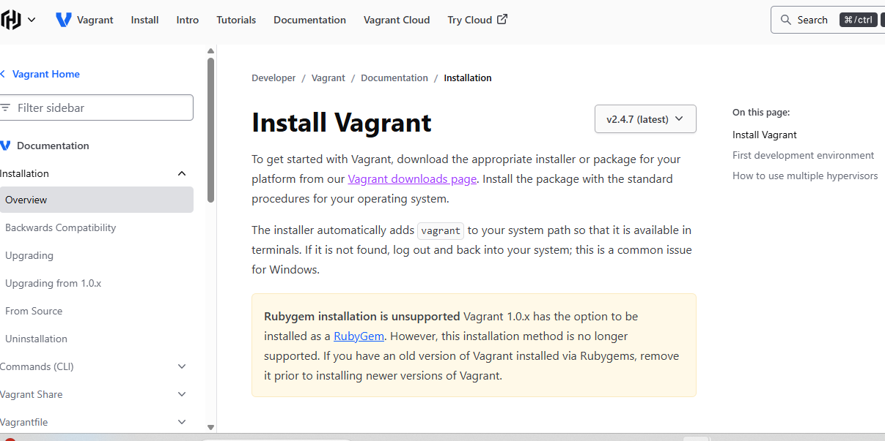

# DevOps Class Prerequisites for Windows


1) Git Bash
2) Virutal Box
3) Vagrant
4) Docker

1)
## Install Git Bash


Git website: "https://git-scm.com/downloads/win"

Then click the "Download for Windows"  button.

It will start Downloading 
After complete the downloading

Run the installer by "Double-Clicking" it


# Git Bash Set Up Process

Start the setup process by Clicking "Next"




In the process of set uping  At "CHOOSING SSH EXECUTABLE" 
CLICK "USE EXTERNAL OPENSSH"

Then "SET UP THE CONFIGURATION" by keeping every thing DEFAULT then click "Next" for all Following terms
At the End click the install Button 
And it will start Installing and finishes the set up Process

2)
## Install  virutal Box 


virutal Box website: "https://www.virtualbox.org/"

Then click the "Download" Button.
After you can see "Virutal Box Platform Packages"
In that Click "Windows Hosts" 

It will start Downloading 
After complete the Downloading 

Run the Installer by "Double clicking " it

## Virutal Box Set Up Process
Start the setup process by Clicking "Next"
Then Click "Accept" and Click "Next"

"SET UP THE CONFIGURATION" by keeping every thing DEFAULT then click "Next" for all following Terms 
At the End click the insalling Button 
And it will start Installing and Finishes the set up Process



3)
## Install Vagrant 


Vagrant website:"https://developer.hashicorp.com/vagrant/install"

Then click the "AMD64 Version:2.4.7"
It will get start Downloading 

After complete the downloading
Run the Installer by "Double clicking" it

## Vagrant Set Up Process

Start the setup Processvag by Click "Next"
Then Click "Accept" and Click "Next"

"SET UP THE CONFIGURATION" by keeping every thing DEFAULT then click "Next" for all folowing Terms
At the End Click the installing Button
And it will start Installing and Finishes the set up Process

4)
## DOCKER 


Docker website:"https://docs.docker.com/desktop/setup/install/windows-install/"

Then after complete the Downloading
Run the Installer by "Double  Clicking" it

## Docker Set Up process
Start the Set up the process

Set up all The configuration of all the terms
Start the Installing and Finishng the set up Process

## Install the Docker in the Virtual Box
## Installing apt Repository
first set up DOCKER apt Repository 

```
# Add Docker's official GPG key:
sudo apt-get update
sudo apt-get install ca-certificates curl
sudo install -m 0755 -d /etc/apt/keyrings
sudo curl -fsSL https://download.docker.com/linux/ubuntu/gpg -o /etc/apt/keyrings/docker.asc
sudo chmod a+r /etc/apt/keyrings/docker.asc

# Add the repository to Apt sources:
echo \
  "deb [arch=$(dpkg --print-architecture) signed-by=/etc/apt/keyrings/docker.asc] https://download.docker.com/linux/ubuntu \
  $(. /etc/os-release && echo "${UBUNTU_CODENAME:-$VERSION_CODENAME}") stable" | \
  sudo tee /etc/apt/sources.list.d/docker.list > /dev/null
sudo apt-get update
```
## Install Docker Package

```
sudo apt-get install docker-ce docker-ce-cli containerd.io docker-buildx-plugin docker-compose-plugin

```
## Set up Ubuntu in Windows

### Open Git bash

```
mkdir  ubuntu

```

```
cd  ubuntu

```
```
vagrant init bento/ubuntu-24.04 

```

```
vagrant up

```

```
vagrant ssh
```

### Note : In case you see any failure, better reboot the system, and enable virtualization in the BIOS.

