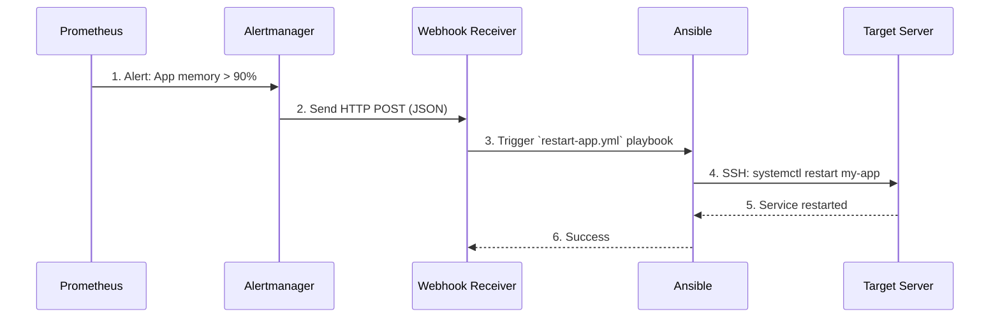

# 🤖 Ansible Basics: Infrastructure as Code & Auto-Remediation

> **Prerequisite for AIOps Module 10 (Auto-Remediation & Self-Healing):** This lesson covers the fundamentals of Ansible so you are prepared to write automated remediation scripts that fix broken systems without human intervention.

---

## 1. What is Ansible?

Ansible is an open-source automation tool used for IT tasks such as configuration management, application deployment, and task automation. 

**Why Ansible for AIOps?**
1. **Agentless:** You do not need to install an "Ansible agent" on target servers. It connects via standard SSH.
2. **Idempotent:** Running an Ansible playbook multiple times is safe. It only makes changes if the system is not already in the desired state.
3. **YAML-based:** It uses simple, human-readable YAML files to define infrastructure state.

---

## 2. Core Concepts

Before writing remediation playbooks, you must understand the four pillars of Ansible:

### A. The Inventory
A simple text file (`hosts.ini`) that tells Ansible *which servers* it is allowed to talk to. Servers are usually grouped by purpose.

```ini
[web_servers]
192.168.1.10
192.168.1.11

[databases]
192.168.1.20
```

### B. Tasks
A task is a single action you want to perform on a server, using an Ansible "module". Examples of modules: `apt` (install packages), `systemd` (manage services), `file` (manage files/folders).

```yaml
- name: Ensure NGINX is running
  systemd:
    name: nginx
    state: started
```

### C. Playbooks
A playbook is a YAML file containing a list of Tasks to be executed on a specific group of servers defined in the Inventory.

### D. Handlers
Handlers are special tasks that *only* run when they are triggered by another task. For example, you only want to restart the database service if the configuration file actually changed.

---

## 3. Putting it Together: A Basic Playbook

Here is a simple playbook (`setup-web.yml`) that installs NGINX, copies a config, and restarts the service if needed.

```yaml
---
- name: Setup Web Servers
  hosts: web_servers          # 1. Target the inventory group
  become: yes                 # 2. Run as sudo/root
  
  tasks:                      # 3. List of actions
    - name: Install NGINX
      apt:
        name: nginx
        state: present
        
    - name: Copy NGINX config
      copy:
        src: ./nginx.conf
        dest: /etc/nginx/nginx.conf
      notify: restart nginx   # 4. Triggers the handler IF the file changed

  handlers:                   # 5. Only runs if notified
    - name: restart nginx
      systemd:
        name: nginx
        state: restarted
```

---

## 4. How Ansible Fits into AIOps (Module 10)

In the **AIOps course**, you won't just be running Ansible from your laptop. You will be using it for **Auto-Remediation**.

When your monitoring system detects an anomaly (e.g., a server running out of memory), it should automatically trigger an Ansible playbook to fix the issue (e.g., restart the memory-leaking application) before a human is even paged.

### The Auto-Remediation Workflow



### Example Auto-Remediation Playbook
In the lab, you will write a playbook similar to this one to clear out temporary logs when a disk full alert fires:

```yaml
---
- name: Auto-Remediate Disk Full Alert
  hosts: all
  become: yes
  
  tasks:
    - name: Clear old temp logs to free up space
      shell: "find /var/log/myapp -name '*.tmp' -mtime +2 -delete"
      
    - name: Log the remediation action
      shell: "echo 'Auto-remediation cleared temp logs at $(date)' >> /var/log/remediation.log"
```

> 💡 **Human-in-the-loop:** Not everything should be auto-remediated! Deleting customer data, scaling down databases, or rolling back major security updates should always require human approval. Auto-remediation is for safe, predictable fixes (like restarting a stuck service or clearing cache).
