# Module 8: Mapping the DevSecOps Pipeline to the OWASP Top 10 (2021)

**Objective:** Explain how the `jeevi-vault` CI/CD pipeline helps reduce web application security risks, demonstrate the controls with examples, and identify where human review and additional tests are needed.

This lesson deliberately uses the **2021 edition** and its A01–A10 numbering. The OWASP Top 10 is an awareness framework, not a certification or a complete security testing checklist. See the [OWASP Top 10:2021](https://top10.owasp.org/2021/).

**Prerequisites:** Basic GitHub Actions, pull requests, HTTP, JavaScript, and application authentication. Allow approximately 90 minutes: 15 for the pipeline, 35 for the risk mappings, 30 for the lab, and 10 for discussion.

---

## DevSecOps Fundamentals

Before diving into specific vulnerabilities, students must understand the core philosophy of DevSecOps.

### What is DevSecOps?
**DevSecOps** stands for Development, Security, and Operations. It is the practice of integrating security testing at every stage of the software development process. Instead of security being a final manual check done by a separate team just before release, it becomes a shared responsibility integrated directly into the daily automated workflow of developers and operators.

### Shift-Left Security
"Shift-Left" means moving security testing earlier (to the left) in the software development lifecycle (SDLC).

```mermaid
graph LR
  subgraph Traditional Approach (Shift-Right)
    direction LR
    T1[Write Code] --> T2[Build] --> T3[Test] --> T4[Deploy] --> T5[Security Audit<br>Too Late & Expensive!]
    style T5 fill:#f87171,color:#fff
  end
  
  subgraph Shift-Left Approach
    direction LR
    S1[Security<br>Design] --> S2[Write Code<br>IDE Scan] --> S3[Build<br>SAST/SCA] --> S4[Test<br>DAST] --> S5[Deploy<br>Safely]
    style S1 fill:#4ade80,color:#fff
    style S2 fill:#4ade80,color:#fff
    style S3 fill:#4ade80,color:#fff
  end
```

*Why?* Fixing a security flaw during the coding phase is exponentially cheaper and faster than fixing it after it is deployed to production.

### Secure SDLC (Software Development Life Cycle)
A Secure SDLC embeds security artifacts and checks into every phase of development.

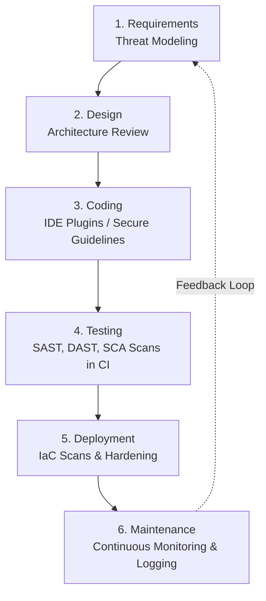

### Security in CI/CD Pipelines
The CI/CD pipeline is the engine of DevSecOps. It enforces security gates automatically:
- **CI (Continuous Integration):** Fails the build if a developer pushes code containing hardcoded secrets or known vulnerable patterns.
- **CD (Continuous Deployment):** Prevents insecure container images from reaching production and enforces environment approval gates.

### Software Supply Chain Attacks
A supply chain attack targets less secure elements in your build process, such as third-party libraries, vendor software, or the CI/CD tools themselves.

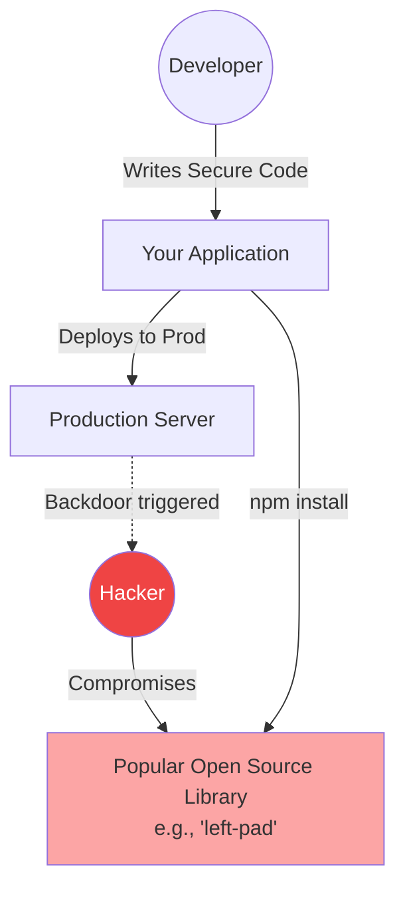
- *Defense:* Treat third-party code as untrusted until verified, pin dependency versions, and scan constantly.

### SBOM and Artifact Integrity
- **SBOM (Software Bill of Materials):** A comprehensive, machine-readable list (like an ingredients label) of every third-party component, library, and framework used in your software. It instantly answers questions like: *"Are we using the vulnerable version of log4j anywhere?"*

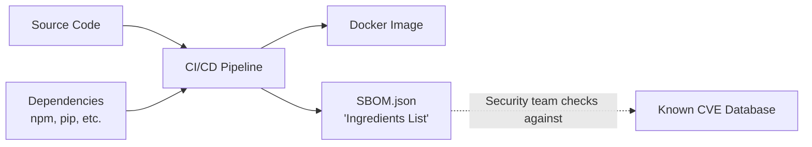

- **Artifact Integrity:** Ensuring that the Docker image or binary you deploy is the exact same one you tested, without tampering. Achieved through cryptographic signing and build provenance attestations.

---

## 0. Foundation: What is OWASP and Why Must We Follow It?

### 0.1 What is OWASP?

**OWASP** stands for the **Open Worldwide Application Security Project**. It is a nonprofit foundation founded in 2001 that produces free, openly available security knowledge for developers, security engineers, and organizations worldwide.

Think of OWASP as the **"WHO of Application Security"** — just as the World Health Organization publishes disease risk data for hospitals to take precautions, OWASP publishes real-world vulnerability data for software teams to take precautions.

OWASP produces:
- **The OWASP Top 10** — The 10 most critical web application security risks (updated every 3–4 years based on real breach data)
- **OWASP ASVS** — Application Security Verification Standard (a testable requirements checklist)
- **OWASP Testing Guide** — How to test applications for vulnerabilities
- **OWASP Cheat Sheet Series** — Developer-friendly secure coding guides

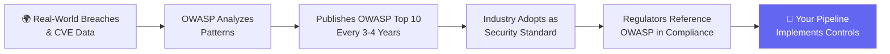

---

### 0.2 Why Must We Follow OWASP?

Following OWASP is not optional for serious organizations. Here are the four key reasons:

#### Reason 1: Real Money and Real Data is at Stake
The OWASP Top 10 is derived from data contributed by **hundreds of organizations** representing **over 500,000 real applications**. Every item on the list represents vulnerabilities that attackers are actively exploiting **today**. Ignoring OWASP means ignoring known, proven attack vectors.

> **Example:** The Equifax breach (2017) exposed 147 million people's personal data. The root cause was **A06 — Vulnerable and Outdated Components**. A patched library was available but not applied.

#### Reason 2: Regulatory and Compliance Requirements
OWASP is referenced by major compliance frameworks that organizations are legally required to follow:

| Compliance Standard | How OWASP is Referenced |
|---|---|
| **PCI DSS v4** | Requires OWASP Top 10 as a minimum baseline for web application security |
| **ISO 27001** | References OWASP practices in Annex A controls |
| **GDPR (EU)** | Requires "appropriate technical measures" — OWASP defines what "appropriate" means |
| **SOC 2** | Auditors use OWASP as benchmark for security controls |
| **HIPAA (US)** | Healthcare apps must implement controls covering OWASP risks |

#### Reason 3: It is the Universal Language of Security
When a security engineer, auditor, or penetration tester says **"A03 Injection"** or **"BOLA"**, every team worldwide knows exactly what is being discussed. OWASP gives teams a **shared vocabulary** to communicate risks without ambiguity.

#### Reason 4: It is How Attackers Think
OWASP Top 10 is ranked by **exploitation likelihood × business impact**. Attackers use this exact same list to decide which vulnerabilities are worth targeting first. If you are not defending against the Top 10, you are leaving the most profitable doors unlocked.

---

### 0.3 What Does "Industry Standard" Mean for Pipelines?

Most companies follow one of three maturity levels for their CI/CD security:

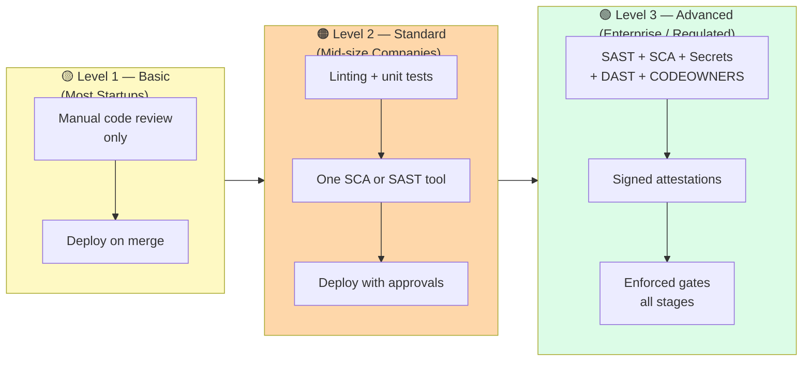

The **industry minimum standard** for a professional team in 2024 is **Level 2** — having at least one automated security scan integrated into the pull request workflow.

---

### 0.4 How the `jeevi-vault` Pipeline Exceeds the Industry Standard

The `jeevi-vault` pipeline does not just meet the Level 2 industry standard — it implements a **Level 3 Enterprise-grade DevSecOps pipeline** with several capabilities that most organizations do not have.

Here is a direct comparison:

| Security Control | Basic Industry\n(Level 1) | Standard Industry\n(Level 2) | `jeevi-vault`\nPipeline (Level 3) |
|---|:---:|:---:|:---:|
| Secrets scanning (Gitleaks) | ❌ | Sometimes | ✅ Every PR |
| SAST — Semgrep | ❌ | Sometimes | ✅ Weekly + on-demand |
| SCA — OSV-Scanner | ❌ | Sometimes | ✅ Every PR + weekly |
| Automated Dependabot PRs | ❌ | ❌ | ✅ Daily (Actions) + Weekly (npm) |
| DAST — ZAP (dynamic testing) | ❌ | ❌ | ✅ Post-deploy staging |
| CODEOWNERS enforcement | ❌ | Sometimes | ✅ Mandatory reviewers |
| Action SHA pinning (supply chain) | ❌ | ❌ | ✅ All actions pinned to SHA |
| Build provenance attestations | ❌ | ❌ | ✅ Signed + stored |
| Runner egress hardening | ❌ | ❌ | ✅ step-security/harden-runner |
| Dependency lifecycle (rotation) | ❌ | ❌ | ✅ Dependabot + labels |

**Summary:** Most companies stop at "we run some tests before merging." The `jeevi-vault` pipeline defends across **7 distinct attack surfaces** (code, secrets, dependencies, configuration, supply chain, runtime behavior, and infrastructure) with automated enforcement gates at every stage.

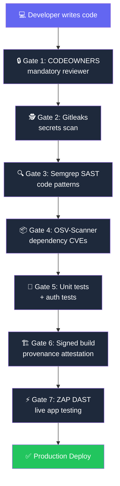

> **Key Teaching Point for Students:** Any single gate can fail and stop a deployment. This is called **defence in depth** — even if an attacker bypasses one control, the next gate catches it. A normal company with only one gate has no defence in depth.

---

## 1. How the tools fit together

| Control | Meaning | Main question |
|---|---|---|
| SAST — Semgrep | Static Application Security Testing | Does the source contain a risky code pattern? |
| SCA — OSV-Scanner | Software Composition Analysis | Do scanned dependencies have known vulnerabilities? |
| Secrets scanning — Gitleaks | Detection of credentials in scanned content | Has a secret entered version control? |
| DAST — ZAP | Dynamic Application Security Testing | What security issues are observable in the running application? |
| CODEOWNERS and peer review | Human review of sensitive changes | Is this design and implementation appropriate? |
| Runner hardening | Protection and monitoring of CI execution | What can build steps access or communicate with? |
| Provenance and attestations | Evidence connecting artifacts to their build | Can we verify where these exact bytes came from? |

The following diagram shows a **recommended teaching pipeline**, including improvements beyond the current repository. A gate must have a failing condition and an enforced dependency or required status check to block progress.

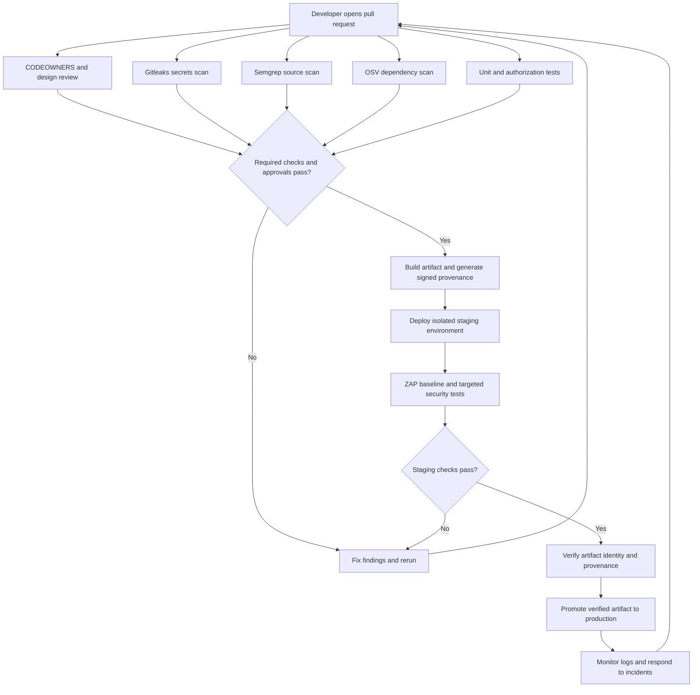

### What is present in `jeevi-vault`?

These observations come from the local files inspected for this lesson. They describe configuration, not proof that scans passed or repository settings enforce them.

| File | Observed configuration | Teaching implication |
|---|---|---|
| [`ci.yml`](../jeevi-vault/.github/workflows/ci.yml) | Gitleaks, OSV and Semgrep in the security job; build depends on security | Inspect triggers, scan scope and finding policies before claiming merge protection |
| [`osv-scanner.yml`](../jeevi-vault/.github/workflows/osv-scanner.yml) | Weekly/manual recursive scan | Periodic discovery complements CI scans |
| [`security-semgrep.yml`](../jeevi-vault/.github/workflows/security-semgrep.yml) | Weekly/manual scan with `--error` | A separate scheduled job is not automatically a PR gate |
| [`dependabot.yml`](../jeevi-vault/.github/dependabot.yml) | Weekly npm updates for root and frontend; daily Actions updates | Update PRs still need review, tests and deployment |
| [`CODEOWNERS`](../jeevi-vault/.github/CODEOWNERS) | Owners for workflows, security configuration, auth, crypto and dependencies | Required owner approval must also be enabled in repository rules |
| [`generate-provenance.js`](../jeevi-vault/scripts/generate-provenance.js) | Artifact hashes and a custom provenance record | This is not equivalent to trusted signed build provenance |

The main workflow runs ZAP Baseline **after deployment**, including production. Its production deployment depends on `build`, not on successful staging integrity checks. Do not describe the existing ZAP job as a pre-production promotion gate. Runner hardening uses `egress-policy: audit`; this setting observes egress rather than enforcing an outbound allowlist.

## 2. OWASP coverage at a glance

| OWASP 2021 risk | Helpful pipeline controls | Additional work needed |
|---|---|---|
| A01 Broken Access Control | Semgrep; targeted authenticated testing | Object ownership and role tests |
| A02 Cryptographic Failures | Gitleaks; crypto review | TLS, encryption, key management and rotation |
| A03 Injection | Semgrep; configured active ZAP scans | Parameterization, safe output handling and regression tests |
| A04 Insecure Design | CODEOWNERS; peer review | Threat modeling and abuse-case review |
| A05 Security Misconfiguration | ZAP Baseline; runner hardening | Application and infrastructure configuration review |
| A06 Vulnerable and Outdated Components | OSV-Scanner; Dependabot | Complete inventory, patch validation and deployment |
| A07 Identification and Authentication Failures | ZAP cookie observations; authentication tests | MFA, rate limits, session lifecycle testing |
| A08 Software and Data Integrity Failures | Action SHA pinning; verified attestations | Trusted builders and consumer-side verification |
| A09 Security Logging and Monitoring Failures | Controlled security tests; operational monitoring | Application audit events, alert routing and response |
| A10 Server-Side Request Forgery | Semgrep; targeted dynamic tests | Destination restrictions and network controls |

### 2.1. What are the equivalents in industry?

The tools in this course already belong to industry security categories. Semgrep, ZAP, Gitleaks and OSV-Scanner are practical tools, not merely classroom simulations. In larger environments, teams may add centralized policies, reporting, identity integration, inventory and remediation tracking.

Here, **equivalent means serving a similar purpose**, not identical features or a drop-in replacement. Some entries below are complementary controls: a secrets manager does not replace a secrets scanner, and an identity provider does not replace application authorization checks. Product coverage depends on configuration, supported languages, edition and deployment model.

| Course control | Industry term | Comparable tools or practices | Important distinction |
|---|---|---|---|
| Semgrep | Static Application Security Testing (SAST) | GitHub CodeQL; SonarQube security analysis | Rules, language coverage and analysis depth differ |
| ZAP | Dynamic Application Security Testing (DAST) | Burp Suite DAST; authenticated application penetration testing | Passive scanning, active scanning and human testing have different coverage |
| Gitleaks | Secret detection / secret scanning | GitHub secret scanning | Detection does not store, rotate or revoke credentials |
| OSV-Scanner | Software Composition Analysis (SCA) | Snyk Open Source; dependency vulnerability analysis | SCA examines third-party components; SAST examines application code |
| Dependabot | Automated dependency maintenance | Dependency update PRs followed by testing and release | Opening a PR does not patch deployed software |
| CODEOWNERS and review | Secure SDLC governance / security design review | Required approvals, threat modeling and security acceptance criteria | Review ownership must be backed by enforceable repository rules |
| Runner hardening | CI/CD security / build environment hardening | Isolated runners, least-privilege tokens and outbound access policies | Protecting CI does not harden the deployed application |
| Artifact provenance | Software supply chain security | GitHub artifact attestations; Sigstore Cosign verification | Trust requires verification of artifact digest and signer or builder identity |
| Application logs and alerts | Security monitoring / detection engineering | A SIEM such as Microsoft Sentinel; response procedures | Collecting logs alone does not guarantee detection or response |
| Configuration review | Infrastructure as Code (IaC) security | Checkov for supported IaC formats | Static infrastructure checks complement runtime application testing |

Tool references: [GitHub security capabilities](https://github.com/security/advanced-security), [Sonar security analysis](https://www.sonarsource.com/solutions/security/), [Burp Suite DAST](https://portswigger.net/burp/documentation/dast), [Snyk on SCA](https://snyk.io/articles/open-source-security/software-composition-analysis-sca/), [Cosign verification](https://docs.sigstore.dev/cosign/verifying/verify/), [Microsoft Sentinel](https://learn.microsoft.com/en-us/azure/sentinel/overview), and [Checkov](https://www.checkov.io/1.Welcome/What%20is%20Checkov.html).

### 2.2. Teaching each row as an industry scenario

For each risk, explain **what can go wrong, which control helps, who implements it, and what evidence demonstrates success**. The responsibilities below are illustrative; organizations divide them differently.

#### A01: Authorization engineering and API security testing

**Explain it:** Authentication asks, “Who are you?” Authorization asks, “May you perform this action on this particular resource?” A valid employee badge should not open every room in the building.

**Industry vocabulary:** RBAC (Role-Based Access Control) grants permissions through roles; ABAC (Attribute-Based Access Control) evaluates attributes such as user, tenant and resource. IDOR (Insecure Direct Object Reference) and BOLA (Broken Object Level Authorization) describe related failures where changing an object identifier bypasses access restrictions.

**Workplace example:** A support agent may view a ticket in their assigned tenant but cannot export every customer's tickets. The application must enforce both action permissions and tenant or object scope on the server.

**Controls and equivalents:** Developers implement authorization; QA and application security engineers test a role-and-resource matrix. Semgrep or CodeQL can find selected code patterns. Configured ZAP access-control testing and manual API testing check behavior using different users. See [ZAP access-control testing](https://www.zaproxy.org/docs/desktop/addons/access-control-testing/).

**Teaching evidence:** Show the same request succeeding for an owner and failing for another user. Also test an administrator-only action with an ordinary account. Hiding a button is not evidence of server-side enforcement.

**Scenario diagram:**

```mermaid
flowchart LR
    A["👤 Support Agent\n(Valid Login)"] -->|"GET /tickets/456\n(Another tenant's ticket)"|  B["🖥️ API Server"]
    B --> C{"Is user authorized\nfor THIS resource?"}
    C -->|"❌ Checks login only"| D["🔓 Returns Bob's data\nBOLA Vulnerability"]
    C -->|"✅ Checks owner + tenant"| E["✅ 404 Not Found\nSafe Response"]
    style D fill:#ff4d4d,color:#fff
    style E fill:#22c55e,color:#fff
```

#### A02: Secrets management and cryptographic key management

**Explain it:** Finding a key left on a desk and providing a secure key cabinet are different jobs. Gitleaks detects certain exposed credentials; secure storage and lifecycle management require additional controls.

**Industry vocabulary:** Secrets management controls credentials; KMS (Key Management Service) manages cryptographic keys; rotation replaces credentials or keys; revocation stops their use. Encryption in transit protects network traffic, while encryption at rest protects stored data.

**Workplace example:** A service retrieves its database credential through its workload identity, rather than storing it in Git. Access is restricted, usage is audited, and a rotation procedure updates the service safely.

**Controls and equivalents:** GitHub secret scanning serves a similar detection role to Gitleaks. HashiCorp Vault provides secrets-management capabilities and key-management integrations; these complement scanning. Platform and security teams define storage, access and lifecycle policies. See [GitHub secret scanning](https://docs.github.com/en/code-security/concepts/secret-security/secret-scanning) and [Vault capabilities](https://www.hashicorp.com/en/products/vault/features).

**Teaching evidence:** Demonstrate a synthetic secret finding, then show how the application receives a secret without embedding it in source or logs. Discuss how a real leaked credential would be revoked. Key rotation for encrypted data also requires a plan to retain necessary decryption access.

**Scenario diagram:**

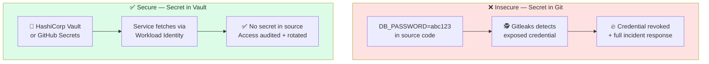

#### A03: Secure coding, SAST and DAST

**Explain it:** Injection happens when data is treated as instructions. A search term should remain a search term, even when it contains characters that have meaning in SQL or HTML.

**Industry vocabulary:** A source is where untrusted data enters; a sink is a sensitive operation such as executing a query. Taint analysis follows potentially unsafe data from source to sink. Parameterized queries separate SQL instructions from values.

**Workplace example:** A customer search API builds SQL using string concatenation. Developers replace it with bound parameters, add a regression test, and rerun the applicable static scan and authorized dynamic tests.

**Controls and equivalents:** Semgrep, CodeQL and SonarQube provide forms of static security analysis. ZAP active scanning and Burp Suite DAST test running applications. They complement developer tests; neither can guarantee every route or data flow is covered.

**Teaching evidence:** Show vulnerable code, the relevant finding, the corrected code and a test proving input remains data. Explain why a SQL fix does not automatically fix XSS or command injection.

**Scenario diagram:**

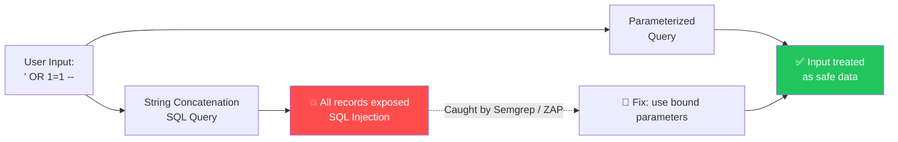

#### A04: Threat modeling and secure design review

**Explain it:** An accurately built house can still be unsafe if the plan omitted door locks. Review the intended behavior before relying on scanners to inspect the implementation.

**Industry vocabulary:** The Secure Software Development Lifecycle (Secure SDLC) includes security throughout planning, design, coding, testing and operations. Threat modeling considers assets, attackers, trust boundaries and abuse cases. A security acceptance criterion states a behavior that must be demonstrated before release.

**Workplace example:** Before building password recovery, the team specifies token expiry, single use, rate limits and behavior that avoids revealing whether an account exists. These requirements become review items and tests.

**Controls and equivalents:** CODEOWNERS supports review routing. The broader industry practice is security design review with developers, product owners and application security engineers. OWASP ASVS (Application Security Verification Standard) provides requirements for security verification; it can turn a broad Top 10 concern into testable criteria. See [OWASP ASVS](https://owasp.org/projects/asvs).

**Teaching evidence:** Ask students to draw a trust boundary and write one abuse case, its mitigation and an acceptance test. A review approval should be supported by a recorded design decision.

**Scenario diagram:**

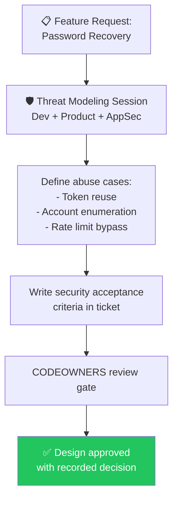

#### A05: Configuration hardening and infrastructure security

**Explain it:** Secure code can be exposed by an unsafe setting: public storage, excessive permissions, verbose error pages or inappropriate HTTP headers.

**Industry vocabulary:** Hardening reduces unnecessary features and access. IaC scanning checks infrastructure definitions before deployment. CSPM (Cloud Security Posture Management) evaluates cloud configuration and posture; configuration drift means the deployed state has moved away from the intended state.

**Workplace example:** A Terraform change would make sensitive storage publicly accessible. An IaC policy flags the change before deployment. Runtime checks separately confirm application behavior and deployed access settings.

**Controls and equivalents:** ZAP observes application responses. Checkov checks supported infrastructure definitions. Platform engineers manage runtime configuration and runner isolation. These address different surfaces; runner hardening is not a replacement for either application or infrastructure checks.

**Teaching evidence:** Compare an unsafe setting, its policy finding and the corrected setting. Explain whether the check inspects source configuration, the CI runner, or the live application.

**Scenario diagram:**

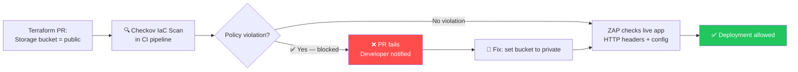

#### A06: Software composition analysis and vulnerability management

**Explain it:** Your application inherits risks from the libraries it uses, including indirect dependencies brought in by other libraries.

**Industry vocabulary:** A direct dependency is explicitly selected; a transitive dependency arrives through another package. A CVE is an identifier for a published vulnerability. An SBOM (Software Bill of Materials) inventories software components. Vulnerability management adds prioritization, ownership, remediation and verification to discovery.

**Workplace example:** A vulnerability is published for a package already deployed. The team identifies affected applications, evaluates exposure, assigns an owner, updates the dependency, tests it and confirms the fixed version is running.

**Controls and equivalents:** OSV-Scanner and Snyk Open Source serve SCA needs with differing coverage. Dependabot supports update proposals. A mature process includes recurring scans, inventory and documented exceptions with review dates; a clean initial release scan is insufficient when advisories appear later.

**Teaching evidence:** Have students trace an advisory to a lockfile entry, a patch PR, passing tests and a deployed version. An SBOM is an inventory, not proof that listed components are safe.

**Scenario diagram:**

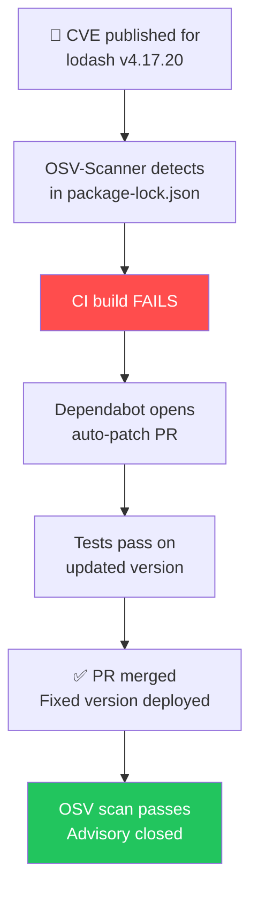

#### A07: Identity and Access Management and session security

**Explain it:** Checking a passport once is not enough if a stolen entry pass remains valid forever. Authentication and session controls must cover the whole login lifecycle.

**Industry vocabulary:** IAM means Identity and Access Management; an IdP is an identity provider; SSO is Single Sign-On; MFA is Multi-Factor Authentication. OpenID Connect supplies an identity layer, while OAuth 2.0 is an authorization framework and is not by itself a user authentication protocol.

**Workplace example:** An application delegates login to an identity provider, then validates tokens and enforces its own resource permissions. The team tests expired tokens, invalid token audience, session renewal and logout behavior.

**Controls and equivalents:** An IAM platform such as Keycloak supports identity integration and SSO; it complements ZAP and authentication tests. Identity teams manage provider policies, while application developers remain responsible for correct integration and session behavior. See [Keycloak](https://www.keycloak.org/).

**Teaching evidence:** Test a rejected expired credential and the configured logout or revocation behavior. Do not assume that all self-contained access tokens become invalid immediately after logout; define the intended lifetime and revocation strategy.

**Scenario diagram:**

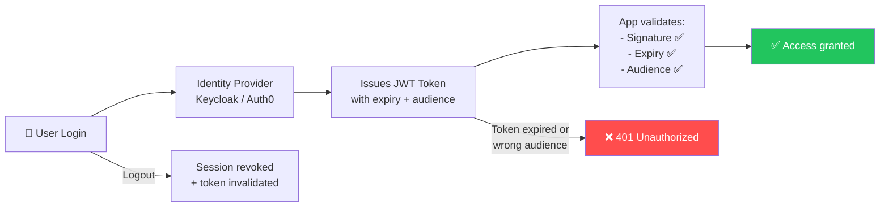

#### A08: Software supply chain security and release verification

**Explain it:** A package labeled “official release” needs evidence connecting its exact contents to the expected build process.

**Industry vocabulary:** A digest identifies content; a signature binds a statement to a signing identity; provenance records build origin. An attestation is a statement about an artifact that can be authenticated. Deployment policy decides which identities and build origins are acceptable.

**Workplace example:** CI builds an artifact, records provenance and signs an attestation. A deployment verifier checks the artifact digest and expected builder identity before allowing promotion. A substituted artifact or an unexpected signer is rejected.

**Controls and equivalents:** Action SHA pinning restricts action references. GitHub artifact attestations and Sigstore Cosign support verifiable supply chain evidence. Build and platform teams must enforce verification; signatures are useful only when the consumer checks the correct trust policy.

**Teaching evidence:** Demonstrate rejection after changing the artifact, and rejection of evidence from an untrusted identity. Explain why a checksum stored beside a file cannot authenticate who built it.

**Scenario diagram:**

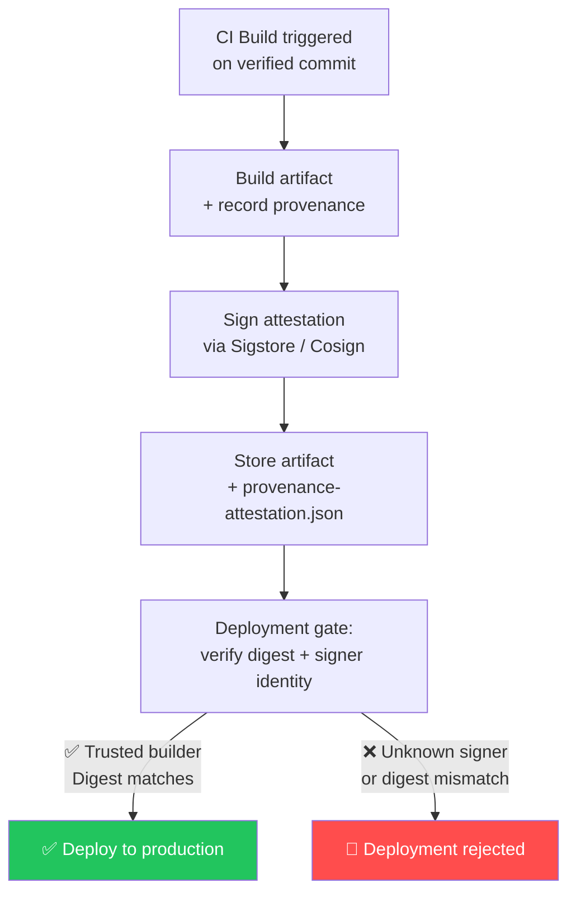

#### A09: Detection engineering, SIEM and incident response

**Explain it:** A door alarm helps only if a sensor detects the event, the alert reaches someone, and that person knows how to respond.

**Industry vocabulary:** SIEM means Security Information and Event Management. A SOC (Security Operations Center) investigates security events. Detection engineering creates and tests rules that turn events into useful alerts. A response playbook defines investigation and containment steps.

**Workplace example:** Several denied vault requests across different item IDs trigger an alert. An analyst correlates account, request IDs and timing, determines whether the activity is malicious, and follows a response procedure.

**Controls and equivalents:** Structured application logs supply evidence to a platform such as Microsoft Sentinel. Security operations teams tune detections; developers ensure the application emits usable events. General uptime monitoring and DAST reports do not replace application security telemetry.

**Teaching evidence:** Trace one controlled event through logging, ingestion, detection and responder notification. Define retention and access rules, and check that sensitive values are absent from logs.

**Scenario diagram:**

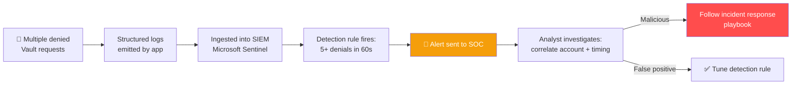

#### A10: Outbound request security and egress control

**Explain it:** With SSRF, an attacker persuades your server to act as their messenger. The server may be able to reach destinations that the attacker cannot access directly.

**Industry vocabulary:** Egress is outbound traffic. A destination allowlist permits only specified targets. Network segmentation limits reachability. SSRF differs from CSRF: SSRF abuses server-originated requests, whereas CSRF abuses a user's browser context.

**Workplace example:** A document importer accepts a URL. A secure design restricts destination selection, validates relevant addresses, controls redirects and limits outbound network access. If arbitrary destinations are unnecessary, use server-selected origins and constrained document IDs instead.

**Controls and equivalents:** Semgrep or CodeQL can identify selected unsafe request flows. Configured dynamic or manual testing validates behavior. Application teams own destination handling; platform teams enforce available outbound restrictions. This is a combination of code controls and network policy, not a single “SSRF scanner.” See the [OWASP SSRF Prevention Cheat Sheet](https://cheatsheetseries.owasp.org/cheatsheets/Server_Side_Request_Forgery_Prevention_Cheat_Sheet.html).

**Teaching evidence:** Use controlled lab destinations to verify rejected unapproved targets and redirects. A hostname string check alone is insufficient when DNS resolution or redirection can change the eventual destination.

**Scenario diagram:**

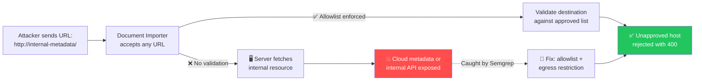

### 2.3. How teams turn a finding into a verified fix

Use this lifecycle to connect tools with professional responsibilities. A tool report is the beginning of a decision, and closure requires evidence.

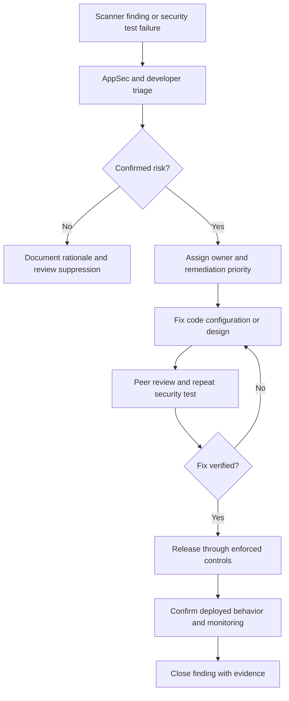

**Classroom discussion:** “The scanner is green. Can we release?” Ask students to identify the scanned scope, required approvals, deployment gates and operational evidence. Their answer should explain which risks were tested and which still need another control.

## 3. A01 — Broken Access Control

**Risk:** A user can read or modify a resource they are not allowed to access. Being logged in does not mean being authorized to read every vault item.

**Example:** Alice changes `/api/items/alice-item` to `/api/items/bob-item`. If the server only checks login, it may return Bob's data.

Illustrative application logic, with authentication supplied by middleware:

```javascript
// Vulnerable: the item ID alone determines access.
const item = await repository.findById(itemId);
return json(item);

// Safer: scope the lookup to the authenticated owner.
const ownedItem = await repository.findByIdAndOwner(itemId, session.userId);
if (!ownedItem) return new Response("Not found", { status: 404 });
return json(ownedItem);
```

Semgrep can flag selected missing checks when suitable rules exist. Generic rules cannot infer every application's ownership policy. ZAP needs authentication contexts and explicit authorization expectations for meaningful role testing; Baseline alone does not prove protected routes are secure.

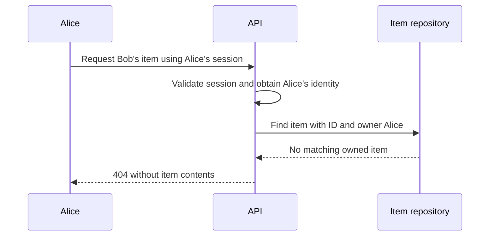

**Student check:** Test anonymous access, owner access, another user's access, and a lower-privilege role. Expect anonymous requests to be rejected, the owner to succeed, and other users to receive 403 or 404 without sensitive data.

## 4. A02 — Cryptographic Failures

**Risk:** Sensitive data is exposed because encryption, transport security, or key handling is inadequate.

Gitleaks contributes by detecting matching committed secrets. It does not verify encryption algorithms, TLS configuration, or every possible credential format. A CI scan runs after a commit has reached the repository; it cannot guarantee the secret was never exposed.

Actual step from `ci.yml`:

```yaml
- name: 🕵️ Gitleaks Scan
  uses: gitleaks/gitleaks-action@dcedce43c6f43de0b836d1fe38946645c9c638dc # v2
  env:
    GITHUB_TOKEN: ${{ secrets.GITHUB_TOKEN }}
    GITLEAKS_ENABLE_UPLOAD_ARTIFACT: false
  with:
    fail: true
```

**Example:** A developer commits a credential instead of reading it from a server-side secret binding. A matching Gitleaks rule fails the security job. The developer removes the credential and, if real, revokes or rotates it; deleting the line does not remove existing exposure.

**Student check:** Use an instructor-provided synthetic fixture matching a configured rule. Never use a live credential. Explain why a clean scan does not establish that stored vault data is encrypted correctly.

## 5. A03 — Injection

**Risk:** Untrusted input is interpreted as executable SQL, HTML/JavaScript, or shell commands.

Illustrative SQL example:

```javascript
// Vulnerable: input becomes part of the query structure.
const unsafeQuery = `SELECT id FROM items WHERE title = '${title}'`;

// Safer: a bound parameter treats input as data.
const result = await env.DB
  .prepare("SELECT id FROM items WHERE title = ? AND owner_id = ?")
  .bind(title, session.userId)
  .all();
```

Semgrep can identify injection patterns covered by its rules. ZAP **active scanning** can send attack payloads when configured against an authorized test target. **ZAP Baseline only spiders and passively analyzes traffic; it does not perform injection attacks.** See the [ZAP Baseline documentation](https://www.zaproxy.org/docs/docker/baseline-scan/).

**Student check:** In a disposable lab, search for a title containing an apostrophe and verify it is treated literally. Review the source to confirm parameter binding. For XSS, use context-appropriate output encoding and safe rendering; SQL parameterization does not prevent XSS.

## 6. A04 — Insecure Design

**Risk:** The system lacks a necessary security control even if the implementation follows its design.

**Example:** A vault share link never expires and can be used indefinitely by anyone who obtains it. A scanner may find no coding defect, while the design still exposes sensitive information.

Review should define link expiry, revocation, recipient scope, token entropy, and audit events. Threat modeling should identify assets, trust boundaries, and likely abuse cases. These activities address the design concerns described by [OWASP A04](https://owasp.org/Top10/en/A04_2021-Insecure_Design/).

Excerpt from the repository's `CODEOWNERS`:

```text
.github/workflows/                @deenamanick
src/crypto/                       @deenamanick
src/auth/                         @deenamanick
```

`CODEOWNERS` requests reviews. Mandatory approval requires branch protection or rulesets that require code owner reviews; verify path coverage and bypass settings too. See [GitHub's code owner documentation](https://docs.github.com/en/repositories/managing-your-repositorys-settings-and-features/customizing-your-repository/about-code-owners).

**Student check:** Write one abuse case for public sharing and propose a design change with an acceptance test.

## 7. A05 — Security Misconfiguration

**Risk:** Unsafe defaults or configuration expose the application, infrastructure, or build environment.

**Example:** A response lacks a suitable Content Security Policy, or an error response reveals internal implementation details. ZAP Baseline can report relevant passive findings on responses it observes.

Actual baseline step from the staging integrity job:

```yaml
- name: ⚡ DAST (OWASP ZAP)
  uses: zaproxy/action-baseline@906a3c93ffde4864839d31a93daadcbd2737b4da # v0.12.0
  with:
    target: 'https://staging-vault.jeeviacademy.com'
```

The YAML is an existing configuration excerpt, not an instruction to scan that site. Use your assigned lab URL for exercises. Configure alert severity and failure handling deliberately; a generated report alone does not establish an enforced gate.

Runner hardening addresses the CI environment. In this repository, `egress-policy: audit` is useful for observation, but should not be presented as blocking unexpected destinations. It also does not configure the deployed application's headers.

**Student check:** Remove a security header in the lab, inspect the finding, restore an application-appropriate policy, and rescan the same route.

## 8. A06 — Vulnerable and Outdated Components

**Risk:** An application uses dependencies with known weaknesses or unsupported components.

OSV-Scanner detects known vulnerabilities in its scan scope. Dependabot proposes dependency changes. Neither completely solves this category: scan coverage, advisory data, exceptions, patch availability, and deployment all matter. See [OWASP A06](https://owasp.org/Top10/en/A06_2021-Vulnerable_and_Outdated_Components/).

Excerpt from the main CI workflow:

```yaml
- name: 🔎 OSV Dependency Diff (PR Only)
  if: github.event_name == 'pull_request'
  uses: google/osv-scanner-action/osv-scanner-action@764c91816374ff2d8fc2095dab36eecd42d61638 # v1.9.2
  with:
    scan-args: |
      --config=.osv-scanner.toml
      --lockfile=package-lock.json
      --compare-ref=origin/staging
```

This is a repository excerpt, not a universal installation recipe. Check that the comparison ref is available and the pinned scanner supports the arguments. This step names the root lockfile; it does not establish frontend lockfile coverage. The separate `osv-scanner.yml` runs `osv-scanner -r .` weekly or manually and installs the scanner using `@latest`, which is a reproducibility improvement opportunity.

```mermaid
flowchart LR
    A[Known vulnerable dependency] --> B[OSV finding]
    B --> C[Review advisory and affected scope]
    C --> D[Dependabot or developer opens patch PR]
    D --> E[Update lockfile and run tests]
    E --> F[Rescan affected dependency inventory]
    F --> G[Merge and deploy patched build]
```

**Student check:** Use a prepared vulnerable lockfile in an isolated exercise. Record the advisory ID and affected package, patch it, and confirm both the scan and application tests pass. Inspect root and frontend dependencies.

## 9. A07 — Identification and Authentication Failures

**Risk:** Attackers can impersonate users or misuse sessions because identity and session controls are weak.

**Example:** A session cookie lacks `Secure` or `HttpOnly`, or logout does not invalidate a server-side session.

Illustrative cookie configuration for an HTTPS application:

```http
Set-Cookie: session=<opaque-random-token>; Path=/; Secure; HttpOnly; SameSite=Lax
```

ZAP can flag some cookie properties in observed responses. Cookie flags do not prove session tokens are unpredictable or that authentication is secure. Use dedicated tests for session rotation after login, logout invalidation, password reset expiry, rate limiting, and MFA where appropriate.

**Student check:** Log out, replay the old session against a protected endpoint, and verify rejection. Ensure the scanner actually reaches authenticated endpoints when testing session behavior.

## 10. A08 — Software and Data Integrity Failures

**Risk:** The system trusts modified software, build outputs, updates, or data without adequate integrity verification.

Action SHA pinning fixes the referenced action source to a particular commit:

```yaml
- uses: actions/checkout@34e114876b0b11c390a56381ad16ebd13914f8d5 # v4
```

Review the chosen commit and update it deliberately. Pinning does not prove the action is safe or freeze everything it downloads. The repository also contains tag-based references, so pinning is not universal.

### Checksums versus trusted attestations

The current `generate-provenance.js` records artifact hashes and computes a value labeled `signature` using a SHA-256 hash of the payload plus `GITHUB_SHA` or a fallback string. A commit SHA is public; this is **not a digital signature authenticating a trusted builder**. An attacker able to rewrite both files and metadata can recompute it.

The script also returns `false` on a provenance signature mismatch without the CLI converting that result to a nonzero exit code. That path must be corrected before treating verification as a reliable gate. These are observations for the lesson; this document does not modify the pipeline.

For a stronger design, create signed artifact attestations, verify the expected repository and builder identity, and validate the digest of the artifact being promoted. GitHub documents both generation and verification in [Using artifact attestations](https://docs.github.com/en/actions/how-tos/secure-your-work/use-artifact-attestations/use-artifact-attestations).

```mermaid
flowchart TD
    A[Trusted build workflow] --> B[Release artifact]
    B --> C[Compute artifact digest]
    A --> D[Authenticated build identity]
    C --> E[Signed provenance attestation]
    D --> E
    B --> F[Deployment verifier]
    E --> F
    F --> G{Digest and trusted identity match?}
    G -->|Yes| H[Deploy verified artifact]
    G -->|No| I[Reject deployment]
```

**Student check:** Modify a copied lab artifact after creating its provenance. Verification must fail with a nonzero exit code. Also test changed provenance metadata and an unexpected builder identity when using signed attestations.

## 11. A09 — Security Logging and Monitoring Failures

**Risk:** Suspicious activity is not recorded, detected, or acted on in time.

**Example:** Repeated denied access to another user's vault produces no searchable audit event or alert.

Illustrative application event:

```json
{
  "event": "authorization_denied",
  "actor_id": "lab-user-a",
  "resource_type": "vault_item",
  "request_id": "lab-request-123",
  "status": 403
}
```

A ZAP report is scanner output, not proof that the application logged an attack. Generate a controlled denied request, find its application event, confirm ingestion into the logging platform or SIEM, and verify the expected alert reaches its responder. Do not log passwords, session tokens, encryption keys, or vault contents.

**Student check:** Supply the request ID, matching log event, and alert evidence for an instructor-defined threshold. Explain who responds and what they do next.

## 12. A10 — Server-Side Request Forgery (SSRF)

**Risk:** An attacker influences the server to send requests to unintended destinations, potentially exposing internal services or credentials.

**Example:** A URL-preview endpoint passes a user-supplied URL directly to backend `fetch()`.

```javascript
// Vulnerable: arbitrary user input selects the server's destination.
const response = await fetch(userProvidedUrl);
```

A safer design uses a server-controlled destination and accepts only a constrained identifier:

```javascript
// Illustrative: fixed HTTPS origin, constrained path, no redirects.
if (!/^[a-zA-Z0-9_-]{1,64}$/.test(documentId)) {
  return new Response("Invalid document ID", { status: 400 });
}
const url = new URL(`/documents/${documentId}`, "https://docs.example.com");
const response = await fetch(url, { redirect: "error" });
```

This example intentionally avoids arbitrary URL fetching. If arbitrary URLs are required, validation must address resolved addresses, private and link-local networks, redirects, and DNS changes; add suitable outbound network restrictions.

Semgrep can flag relevant request patterns when rules support the code. Targeted dynamic testing may also help, but ZAP Baseline does not establish SSRF protection.

**Student check:** Confirm the lab rejects a full URL where a document ID is expected and cannot redirect requests to an unapproved destination.

## 13. Practical lab — Defend the Flag

**Goal:** Connect a vulnerability to an observable finding, a corrective change, and evidence that the control works.

Use an instructor-owned disposable application with synthetic data. Active scanning requires an explicitly authorized test target. The snippets above illustrate individual controls; they are not complete deployable workflows.

### Lab sequence

1. Choose one challenge from the table below and create a lab branch.
2. Reproduce the insecure behavior or run the relevant scan.
3. Identify the OWASP category and explain the tool's coverage limits.
4. Show the exact workflow step or application test that detects the problem.
5. Apply the fix and rerun the same check.
6. Inspect whether the failed check actually prevents the intended merge or deployment.
7. Submit before/after evidence and describe one remaining risk.

| Challenge | Prepared weakness | Expected evidence after fixing |
|---|---|---|
| A01: Protect the item | Ownership check omitted | Owner succeeds; another user cannot retrieve the item |
| A02: Remove the secret | Synthetic credential fixture | Matching Gitleaks finding disappears after removal |
| A03: Bind the input | Query concatenates input | Parameterized query and passing regression test |
| A04: Expire the link | Share link has no expiry | Reviewed design and expiry/revocation tests |
| A05: Restore the header | Lab response lacks a selected header | Header present and relevant ZAP finding resolved |
| A06: Patch the package | Prepared vulnerable lockfile | Advisory resolved in scan; application tests pass |
| A07: End the session | Old session accepted after logout | Replayed old session rejected |
| A08: Verify the artifact | Artifact changed after build | Verification rejects changed bytes with failure exit status |
| A09: Detect the attempt | Denied requests are not monitored | Correlated application event and routed alert |
| A10: Restrict the destination | Backend accepts arbitrary URL | Unapproved destination rejected |

### Submission template

```text
OWASP category:
Vulnerable behavior:
Relevant workflow step or test:
Before-fix evidence:
Fix applied:
After-fix evidence:
How merge or deployment is blocked:
Remaining limitation:
```

**Assessment:** Award two points each for a correct risk explanation, reproducible evidence, appropriate fix, successful verification, and an accurate statement of the remaining limitation (10 points total).

## 14. Knowledge check

1. Does ZAP Baseline actively test SQL injection? **No; use configured active testing for attack payloads.**
2. Does a `CODEOWNERS` file alone force approval? **No; repository rules must require it.**
3. Does a clean OSV report mean all components are safe? **No; findings depend on scope and known advisory data.**
4. Does a JSON file named `provenance-attestation.json` prove a trusted build? **No; inspect the signing and verification mechanism.**
5. Does a passing CI run eliminate the OWASP Top 10? **No; design, application controls, coverage, and operations remain essential.**
