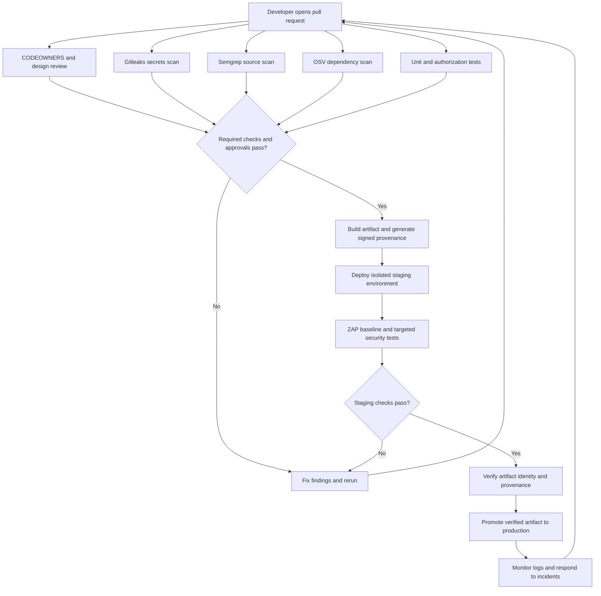
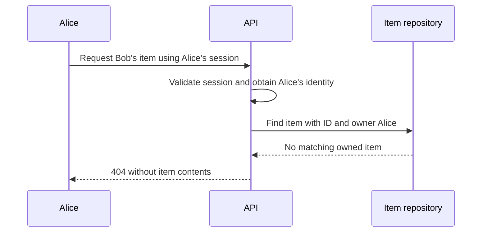
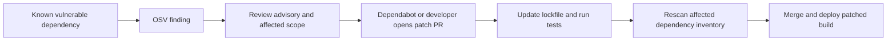
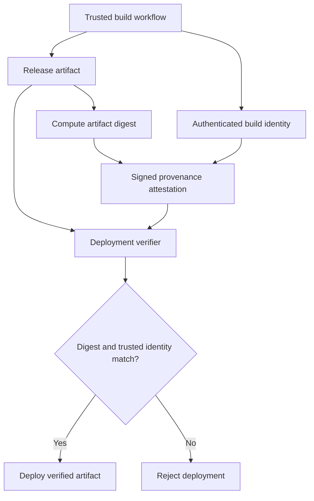

# Module 8: Mapping the DevSecOps Pipeline to the OWASP Top 10 (2021)

**Objective:** Explain how the `jeevi-vault` CI/CD pipeline helps reduce web application security risks, demonstrate the controls with examples, and identify where human review and additional tests are needed.

This lesson deliberately uses the **2021 edition** and its A01–A10 numbering. The OWASP Top 10 is an awareness framework, not a certification or a complete security testing checklist. See the [OWASP Top 10:2021](https://top10.owasp.org/2021/).

**Prerequisites:** Basic GitHub Actions, pull requests, HTTP, JavaScript, and application authentication. Allow approximately 90 minutes: 15 for the pipeline, 35 for the risk mappings, 30 for the lab, and 10 for discussion.

## 1. How the tools fit together

| Control | Meaning | Main question |
|---|---|---|
| SAST — Semgrep | Static Application Security Testing | Does the source contain a risky code pattern? |
| SCA — OSV-Scanner | Software Composition Analysis | Do scanned dependencies have known vulnerabilities? |
| Secrets scanning — Gitleaks | Detection of credentials in scanned content | Has a secret entered version control? |
| DAST — ZAP | Dynamic Application Security Testing | What security issues are observable in the running application? |
| CODEOWNERS and peer review | Human review of sensitive changes | Is this design and implementation appropriate? |
| Runner hardening | Protection and monitoring of CI execution | What can build steps access or communicate with? |
| Provenance and attestations | Evidence connecting artifacts to their build | Can we verify where these exact bytes came from? |

The following diagram shows a **recommended teaching pipeline**, including improvements beyond the current repository. A gate must have a failing condition and an enforced dependency or required status check to block progress.



### What is present in `jeevi-vault`?

These observations come from the local files inspected for this lesson. They describe configuration, not proof that scans passed or repository settings enforce them.

| File | Observed configuration | Teaching implication |
|---|---|---|
| [`ci.yml`](../jeevi-vault/.github/workflows/ci.yml) | Gitleaks, OSV and Semgrep in the security job; build depends on security | Inspect triggers, scan scope and finding policies before claiming merge protection |
| [`osv-scanner.yml`](../jeevi-vault/.github/workflows/osv-scanner.yml) | Weekly/manual recursive scan | Periodic discovery complements CI scans |
| [`security-semgrep.yml`](../jeevi-vault/.github/workflows/security-semgrep.yml) | Weekly/manual scan with `--error` | A separate scheduled job is not automatically a PR gate |
| [`dependabot.yml`](../jeevi-vault/.github/dependabot.yml) | Weekly npm updates for root and frontend; daily Actions updates | Update PRs still need review, tests and deployment |
| [`CODEOWNERS`](../jeevi-vault/.github/CODEOWNERS) | Owners for workflows, security configuration, auth, crypto and dependencies | Required owner approval must also be enabled in repository rules |
| [`generate-provenance.js`](../jeevi-vault/scripts/generate-provenance.js) | Artifact hashes and a custom provenance record | This is not equivalent to trusted signed build provenance |

The main workflow runs ZAP Baseline **after deployment**, including production. Its production deployment depends on `build`, not on successful staging integrity checks. Do not describe the existing ZAP job as a pre-production promotion gate. Runner hardening uses `egress-policy: audit`; this setting observes egress rather than enforcing an outbound allowlist.

## 2. OWASP coverage at a glance

| OWASP 2021 risk | Helpful pipeline controls | Additional work needed |
|---|---|---|
| A01 Broken Access Control | Semgrep; targeted authenticated testing | Object ownership and role tests |
| A02 Cryptographic Failures | Gitleaks; crypto review | TLS, encryption, key management and rotation |
| A03 Injection | Semgrep; configured active ZAP scans | Parameterization, safe output handling and regression tests |
| A04 Insecure Design | CODEOWNERS; peer review | Threat modeling and abuse-case review |
| A05 Security Misconfiguration | ZAP Baseline; runner hardening | Application and infrastructure configuration review |
| A06 Vulnerable and Outdated Components | OSV-Scanner; Dependabot | Complete inventory, patch validation and deployment |
| A07 Identification and Authentication Failures | ZAP cookie observations; authentication tests | MFA, rate limits, session lifecycle testing |
| A08 Software and Data Integrity Failures | Action SHA pinning; verified attestations | Trusted builders and consumer-side verification |
| A09 Security Logging and Monitoring Failures | Controlled security tests; operational monitoring | Application audit events, alert routing and response |
| A10 Server-Side Request Forgery | Semgrep; targeted dynamic tests | Destination restrictions and network controls |

## 3. A01 — Broken Access Control

**Risk:** A user can read or modify a resource they are not allowed to access. Being logged in does not mean being authorized to read every vault item.

**Example:** Alice changes `/api/items/alice-item` to `/api/items/bob-item`. If the server only checks login, it may return Bob's data.

Illustrative application logic, with authentication supplied by middleware:

```javascript
// Vulnerable: the item ID alone determines access.
const item = await repository.findById(itemId);
return json(item);

// Safer: scope the lookup to the authenticated owner.
const ownedItem = await repository.findByIdAndOwner(itemId, session.userId);
if (!ownedItem) return new Response("Not found", { status: 404 });
return json(ownedItem);
```

Semgrep can flag selected missing checks when suitable rules exist. Generic rules cannot infer every application's ownership policy. ZAP needs authentication contexts and explicit authorization expectations for meaningful role testing; Baseline alone does not prove protected routes are secure.



**Student check:** Test anonymous access, owner access, another user's access, and a lower-privilege role. Expect anonymous requests to be rejected, the owner to succeed, and other users to receive 403 or 404 without sensitive data.

## 4. A02 — Cryptographic Failures

**Risk:** Sensitive data is exposed because encryption, transport security, or key handling is inadequate.

Gitleaks contributes by detecting matching committed secrets. It does not verify encryption algorithms, TLS configuration, or every possible credential format. A CI scan runs after a commit has reached the repository; it cannot guarantee the secret was never exposed.

Actual step from `ci.yml`:

```yaml
- name: 🕵️ Gitleaks Scan
  uses: gitleaks/gitleaks-action@dcedce43c6f43de0b836d1fe38946645c9c638dc # v2
  env:
    GITHUB_TOKEN: ${{ secrets.GITHUB_TOKEN }}
    GITLEAKS_ENABLE_UPLOAD_ARTIFACT: false
  with:
    fail: true
```

**Example:** A developer commits a credential instead of reading it from a server-side secret binding. A matching Gitleaks rule fails the security job. The developer removes the credential and, if real, revokes or rotates it; deleting the line does not remove existing exposure.

**Student check:** Use an instructor-provided synthetic fixture matching a configured rule. Never use a live credential. Explain why a clean scan does not establish that stored vault data is encrypted correctly.

## 5. A03 — Injection

**Risk:** Untrusted input is interpreted as executable SQL, HTML/JavaScript, or shell commands.

Illustrative SQL example:

```javascript
// Vulnerable: input becomes part of the query structure.
const unsafeQuery = `SELECT id FROM items WHERE title = '${title}'`;

// Safer: a bound parameter treats input as data.
const result = await env.DB
  .prepare("SELECT id FROM items WHERE title = ? AND owner_id = ?")
  .bind(title, session.userId)
  .all();
```

Semgrep can identify injection patterns covered by its rules. ZAP **active scanning** can send attack payloads when configured against an authorized test target. **ZAP Baseline only spiders and passively analyzes traffic; it does not perform injection attacks.** See the [ZAP Baseline documentation](https://www.zaproxy.org/docs/docker/baseline-scan/).

**Student check:** In a disposable lab, search for a title containing an apostrophe and verify it is treated literally. Review the source to confirm parameter binding. For XSS, use context-appropriate output encoding and safe rendering; SQL parameterization does not prevent XSS.

## 6. A04 — Insecure Design

**Risk:** The system lacks a necessary security control even if the implementation follows its design.

**Example:** A vault share link never expires and can be used indefinitely by anyone who obtains it. A scanner may find no coding defect, while the design still exposes sensitive information.

Review should define link expiry, revocation, recipient scope, token entropy, and audit events. Threat modeling should identify assets, trust boundaries, and likely abuse cases. These activities address the design concerns described by [OWASP A04](https://owasp.org/Top10/en/A04_2021-Insecure_Design/).

Excerpt from the repository's `CODEOWNERS`:

```text
.github/workflows/                @deenamanick
src/crypto/                       @deenamanick
src/auth/                         @deenamanick
```

`CODEOWNERS` requests reviews. Mandatory approval requires branch protection or rulesets that require code owner reviews; verify path coverage and bypass settings too. See [GitHub's code owner documentation](https://docs.github.com/en/repositories/managing-your-repositorys-settings-and-features/customizing-your-repository/about-code-owners).

**Student check:** Write one abuse case for public sharing and propose a design change with an acceptance test.

## 7. A05 — Security Misconfiguration

**Risk:** Unsafe defaults or configuration expose the application, infrastructure, or build environment.

**Example:** A response lacks a suitable Content Security Policy, or an error response reveals internal implementation details. ZAP Baseline can report relevant passive findings on responses it observes.

Actual baseline step from the staging integrity job:

```yaml
- name: ⚡ DAST (OWASP ZAP)
  uses: zaproxy/action-baseline@906a3c93ffde4864839d31a93daadcbd2737b4da # v0.12.0
  with:
    target: 'https://staging-vault.jeeviacademy.com'
```

The YAML is an existing configuration excerpt, not an instruction to scan that site. Use your assigned lab URL for exercises. Configure alert severity and failure handling deliberately; a generated report alone does not establish an enforced gate.

Runner hardening addresses the CI environment. In this repository, `egress-policy: audit` is useful for observation, but should not be presented as blocking unexpected destinations. It also does not configure the deployed application's headers.

**Student check:** Remove a security header in the lab, inspect the finding, restore an application-appropriate policy, and rescan the same route.

## 8. A06 — Vulnerable and Outdated Components

**Risk:** An application uses dependencies with known weaknesses or unsupported components.

OSV-Scanner detects known vulnerabilities in its scan scope. Dependabot proposes dependency changes. Neither completely solves this category: scan coverage, advisory data, exceptions, patch availability, and deployment all matter. See [OWASP A06](https://owasp.org/Top10/en/A06_2021-Vulnerable_and_Outdated_Components/).

Excerpt from the main CI workflow:

```yaml
- name: 🔎 OSV Dependency Diff (PR Only)
  if: github.event_name == 'pull_request'
  uses: google/osv-scanner-action/osv-scanner-action@764c91816374ff2d8fc2095dab36eecd42d61638 # v1.9.2
  with:
    scan-args: |
      --config=.osv-scanner.toml
      --lockfile=package-lock.json
      --compare-ref=origin/staging
```

This is a repository excerpt, not a universal installation recipe. Check that the comparison ref is available and the pinned scanner supports the arguments. This step names the root lockfile; it does not establish frontend lockfile coverage. The separate `osv-scanner.yml` runs `osv-scanner -r .` weekly or manually and installs the scanner using `@latest`, which is a reproducibility improvement opportunity.



**Student check:** Use a prepared vulnerable lockfile in an isolated exercise. Record the advisory ID and affected package, patch it, and confirm both the scan and application tests pass. Inspect root and frontend dependencies.

## 9. A07 — Identification and Authentication Failures

**Risk:** Attackers can impersonate users or misuse sessions because identity and session controls are weak.

**Example:** A session cookie lacks `Secure` or `HttpOnly`, or logout does not invalidate a server-side session.

Illustrative cookie configuration for an HTTPS application:

```http
Set-Cookie: session=<opaque-random-token>; Path=/; Secure; HttpOnly; SameSite=Lax
```

ZAP can flag some cookie properties in observed responses. Cookie flags do not prove session tokens are unpredictable or that authentication is secure. Use dedicated tests for session rotation after login, logout invalidation, password reset expiry, rate limiting, and MFA where appropriate.

**Student check:** Log out, replay the old session against a protected endpoint, and verify rejection. Ensure the scanner actually reaches authenticated endpoints when testing session behavior.

## 10. A08 — Software and Data Integrity Failures

**Risk:** The system trusts modified software, build outputs, updates, or data without adequate integrity verification.

Action SHA pinning fixes the referenced action source to a particular commit:

```yaml
- uses: actions/checkout@34e114876b0b11c390a56381ad16ebd13914f8d5 # v4
```

Review the chosen commit and update it deliberately. Pinning does not prove the action is safe or freeze everything it downloads. The repository also contains tag-based references, so pinning is not universal.

### Checksums versus trusted attestations

The current `generate-provenance.js` records artifact hashes and computes a value labeled `signature` using a SHA-256 hash of the payload plus `GITHUB_SHA` or a fallback string. A commit SHA is public; this is **not a digital signature authenticating a trusted builder**. An attacker able to rewrite both files and metadata can recompute it.

The script also returns `false` on a provenance signature mismatch without the CLI converting that result to a nonzero exit code. That path must be corrected before treating verification as a reliable gate. These are observations for the lesson; this document does not modify the pipeline.

For a stronger design, create signed artifact attestations, verify the expected repository and builder identity, and validate the digest of the artifact being promoted. GitHub documents both generation and verification in [Using artifact attestations](https://docs.github.com/en/actions/how-tos/secure-your-work/use-artifact-attestations/use-artifact-attestations).



**Student check:** Modify a copied lab artifact after creating its provenance. Verification must fail with a nonzero exit code. Also test changed provenance metadata and an unexpected builder identity when using signed attestations.

## 11. A09 — Security Logging and Monitoring Failures

**Risk:** Suspicious activity is not recorded, detected, or acted on in time.

**Example:** Repeated denied access to another user's vault produces no searchable audit event or alert.

Illustrative application event:

```json
{
  "event": "authorization_denied",
  "actor_id": "lab-user-a",
  "resource_type": "vault_item",
  "request_id": "lab-request-123",
  "status": 403
}
```

A ZAP report is scanner output, not proof that the application logged an attack. Generate a controlled denied request, find its application event, confirm ingestion into the logging platform or SIEM, and verify the expected alert reaches its responder. Do not log passwords, session tokens, encryption keys, or vault contents.

**Student check:** Supply the request ID, matching log event, and alert evidence for an instructor-defined threshold. Explain who responds and what they do next.

## 12. A10 — Server-Side Request Forgery (SSRF)

**Risk:** An attacker influences the server to send requests to unintended destinations, potentially exposing internal services or credentials.

**Example:** A URL-preview endpoint passes a user-supplied URL directly to backend `fetch()`.

```javascript
// Vulnerable: arbitrary user input selects the server's destination.
const response = await fetch(userProvidedUrl);
```

A safer design uses a server-controlled destination and accepts only a constrained identifier:

```javascript
// Illustrative: fixed HTTPS origin, constrained path, no redirects.
if (!/^[a-zA-Z0-9_-]{1,64}$/.test(documentId)) {
  return new Response("Invalid document ID", { status: 400 });
}
const url = new URL(`/documents/${documentId}`, "https://docs.example.com");
const response = await fetch(url, { redirect: "error" });
```

This example intentionally avoids arbitrary URL fetching. If arbitrary URLs are required, validation must address resolved addresses, private and link-local networks, redirects, and DNS changes; add suitable outbound network restrictions.

Semgrep can flag relevant request patterns when rules support the code. Targeted dynamic testing may also help, but ZAP Baseline does not establish SSRF protection.

**Student check:** Confirm the lab rejects a full URL where a document ID is expected and cannot redirect requests to an unapproved destination.

## 13. Practical lab — Defend the Flag

**Goal:** Connect a vulnerability to an observable finding, a corrective change, and evidence that the control works.

Use an instructor-owned disposable application with synthetic data. Active scanning requires an explicitly authorized test target. The snippets above illustrate individual controls; they are not complete deployable workflows.

### Lab sequence

1. Choose one challenge from the table below and create a lab branch.
2. Reproduce the insecure behavior or run the relevant scan.
3. Identify the OWASP category and explain the tool's coverage limits.
4. Show the exact workflow step or application test that detects the problem.
5. Apply the fix and rerun the same check.
6. Inspect whether the failed check actually prevents the intended merge or deployment.
7. Submit before/after evidence and describe one remaining risk.

| Challenge | Prepared weakness | Expected evidence after fixing |
|---|---|---|
| A01: Protect the item | Ownership check omitted | Owner succeeds; another user cannot retrieve the item |
| A02: Remove the secret | Synthetic credential fixture | Matching Gitleaks finding disappears after removal |
| A03: Bind the input | Query concatenates input | Parameterized query and passing regression test |
| A04: Expire the link | Share link has no expiry | Reviewed design and expiry/revocation tests |
| A05: Restore the header | Lab response lacks a selected header | Header present and relevant ZAP finding resolved |
| A06: Patch the package | Prepared vulnerable lockfile | Advisory resolved in scan; application tests pass |
| A07: End the session | Old session accepted after logout | Replayed old session rejected |
| A08: Verify the artifact | Artifact changed after build | Verification rejects changed bytes with failure exit status |
| A09: Detect the attempt | Denied requests are not monitored | Correlated application event and routed alert |
| A10: Restrict the destination | Backend accepts arbitrary URL | Unapproved destination rejected |

### Submission template

```text
OWASP category:
Vulnerable behavior:
Relevant workflow step or test:
Before-fix evidence:
Fix applied:
After-fix evidence:
How merge or deployment is blocked:
Remaining limitation:
```

**Assessment:** Award two points each for a correct risk explanation, reproducible evidence, appropriate fix, successful verification, and an accurate statement of the remaining limitation (10 points total).

## 14. Knowledge check

1. Does ZAP Baseline actively test SQL injection? **No; use configured active testing for attack payloads.**
2. Does a `CODEOWNERS` file alone force approval? **No; repository rules must require it.**
3. Does a clean OSV report mean all components are safe? **No; findings depend on scope and known advisory data.**
4. Does a JSON file named `provenance-attestation.json` prove a trusted build? **No; inspect the signing and verification mechanism.**
5. Does a passing CI run eliminate the OWASP Top 10? **No; design, application controls, coverage, and operations remain essential.**
