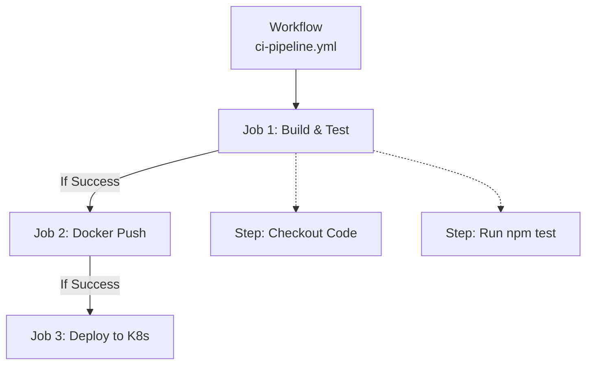

# 🚀 GitHub Actions: The CI/CD Engine

> **Prerequisite for AIOps Module 4:** This lesson introduces GitHub Actions specifically tailored for the CI/CD, testing, and deployment workflows you will build in the AIOps course.

---

## 1. What is GitHub Actions?

GitHub Actions is a Continuous Integration and Continuous Deployment (CI/CD) platform built directly into GitHub. It allows you to automate your software development workflows right where your code lives.

Instead of manually running tests on your laptop or manually uploading code to a server, you write a YAML file that tells GitHub: 
*"Every time someone pushes code, spin up a temporary server, run these tests, and if they pass, deploy it to production."*

### Why do we need it for AIOps?
In the **AIOps Course (Module 4)**, you will be managing machine learning models, LLM APIs, and application code. You need a reliable, automated pipeline to:
- Run automated tests on your ML/LLM components (Unit tests & Golden datasets).
- Build Docker containers containing your AI application.
- Push those images to a registry.
- Deploy them to Kubernetes with manual approval gates.

---

## 2. Core Concepts: The Hierarchy

Every GitHub Actions pipeline is defined in a `.yml` file located in the `.github/workflows/` directory of your repository. 

Understanding the hierarchy is the most important part of GitHub Actions:

1. **Workflow:** The top-level automated process (e.g., "Production Deployment pipeline").
2. **Job:** A set of steps that execute on the same runner (server). Jobs run in *parallel* by default, but you can make them run sequentially (e.g., Deploy only runs *after* Test).
3. **Step:** An individual task within a job (e.g., "Run a shell script" or "Run an action").
4. **Action:** Pre-built, reusable commands (e.g., `actions/checkout@v4` to download your code).



---

## 3. Triggers: When does it run?

Workflows are triggered by events using the `on:` keyword.

### Common Triggers for AIOps
```yaml
on:
  push:
    branches:
      - main       # Runs every time code is pushed to main
  pull_request:
    branches:
      - main       # Runs when a PR is opened targeting main
  workflow_dispatch: # Adds a "Run workflow" button in the GitHub UI (Manual trigger)
```

---

## 4. Environments & Manual Approvals

In your AIOps lab, you will be required to add a **manual approval gate** before deploying to production. 

GitHub Environments allow you to define rules for deployment. If a job is tied to the `production` environment, execution will pause and wait for an authorized human to click "Approve" in the GitHub UI.

```yaml
jobs:
  deploy-prod:
    runs-on: ubuntu-latest
    environment: production # 🛑 This pauses the pipeline for human approval!
    steps:
      - run: echo "Deploying to production..."
```

---

## 5. The AIOps CI/CD Blueprint

In **AIOps Module 4**, you will build a pipeline that looks exactly like this. Study this structure carefully:

```yaml
name: AI Application CI/CD

on:
  push:
    branches: [ "main" ]

jobs:
  # ----------------------------------------------------
  # JOB 1: Test the Code and AI Models
  # ----------------------------------------------------
  test:
    runs-on: ubuntu-latest
    steps:
      - name: Get Code
        uses: actions/checkout@v4
      
      - name: Install Dependencies
        run: npm install
        
      - name: Run Linter
        run: npm run lint
        
      - name: Run Unit & Golden Dataset Tests
        run: npm run test

  # ----------------------------------------------------
  # JOB 2: Build and Push Docker Image
  # ----------------------------------------------------
  build:
    needs: test # Waits for 'test' to finish successfully
    runs-on: ubuntu-latest
    steps:
      - name: Get Code
        uses: actions/checkout@v4
        
      - name: Build Docker Image
        run: docker build -t my-ai-app:latest .
        
      - name: Push to Registry
        run: |
          echo "${{ secrets.DOCKER_PASSWORD }}" | docker login -u myuser --password-stdin
          docker push my-ai-app:latest

  # ----------------------------------------------------
  # JOB 3: Deploy to Kubernetes (Requires Approval)
  # ----------------------------------------------------
  deploy:
    needs: build
    runs-on: ubuntu-latest
    environment: production # Triggers manual approval gate
    steps:
      - name: Deploy via kubectl
        run: |
          # The image is pulled and deployed to the K8s cluster
          # Autoscaling (HPA) takes over from here!
          echo "Triggering Kubernetes Deployment..."
```

### Summary of what this does:
1. **Push Code:** Developer pushes code to `main`.
2. **Lint & Test:** Code is linted and tests (including ML accuracy tests) are run.
3. **Build:** If tests pass, the Docker container is built and uploaded.
4. **Approve:** The pipeline pauses. A manager reviews and approves.
5. **Deploy:** The new container is deployed to the cluster where HPA (Horizontal Pod Autoscaler) manages traffic spikes.
