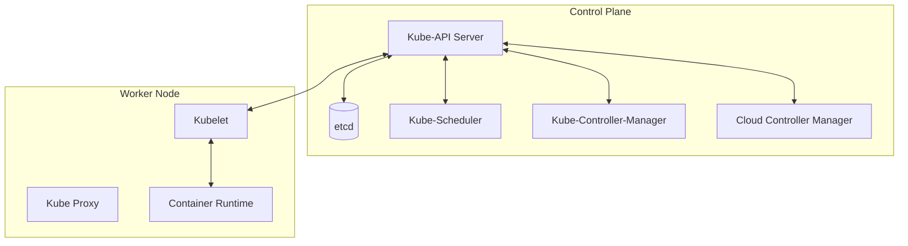
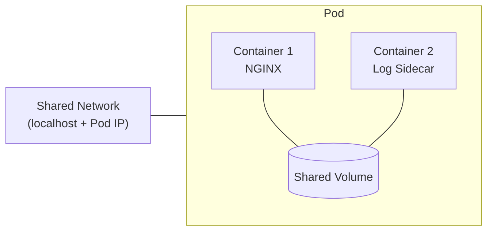
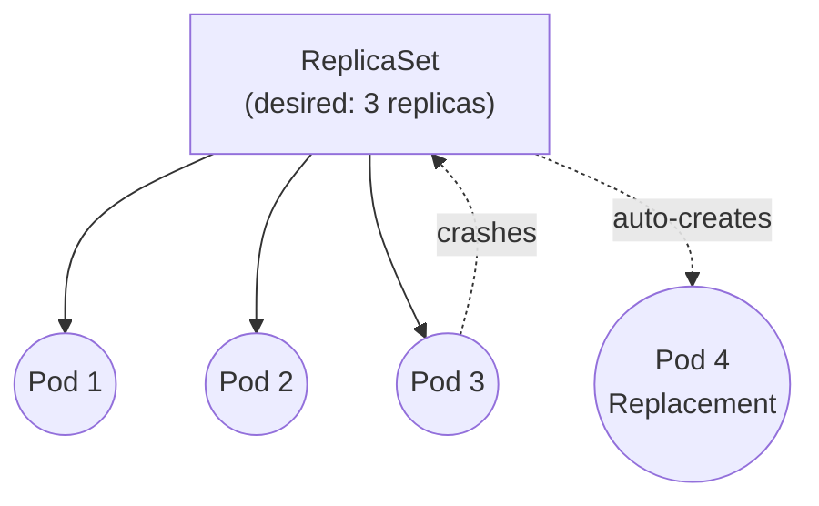
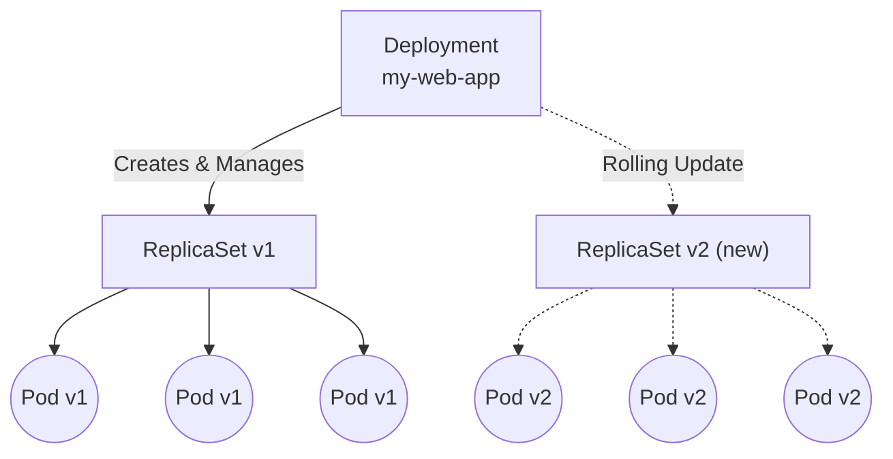
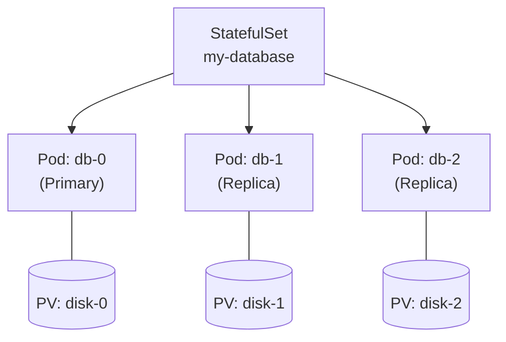
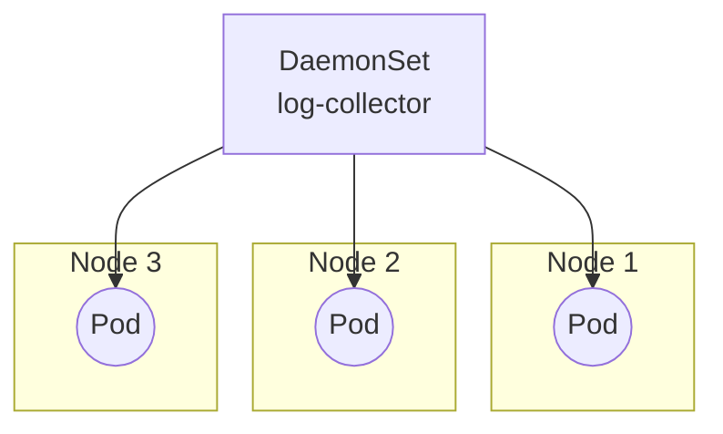
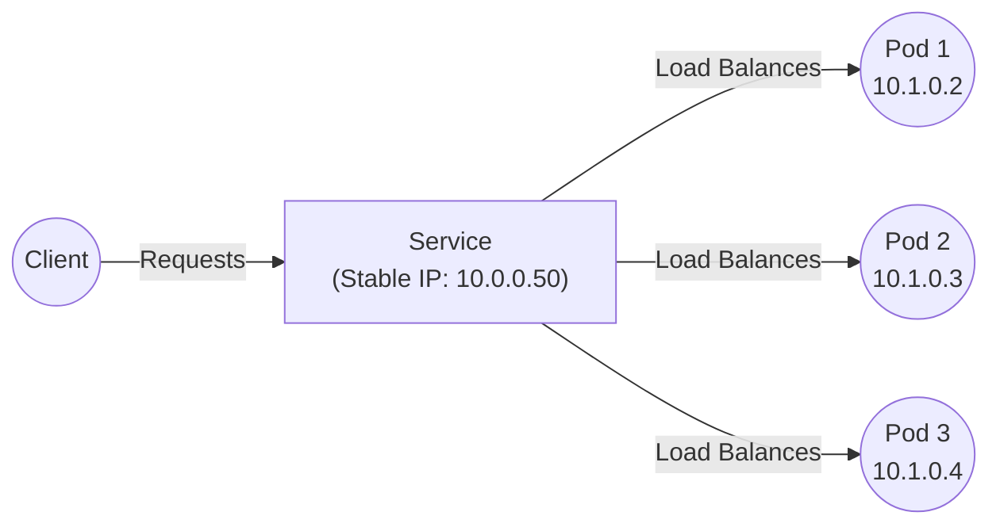
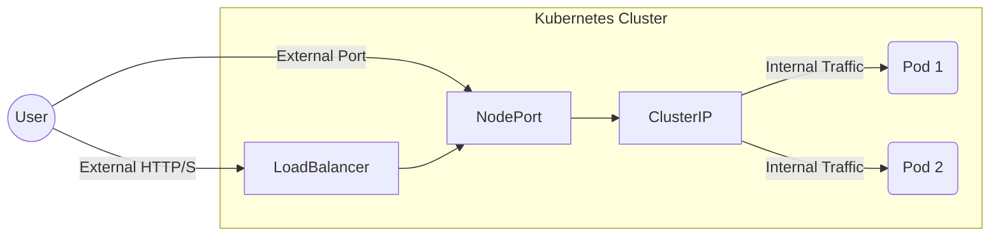
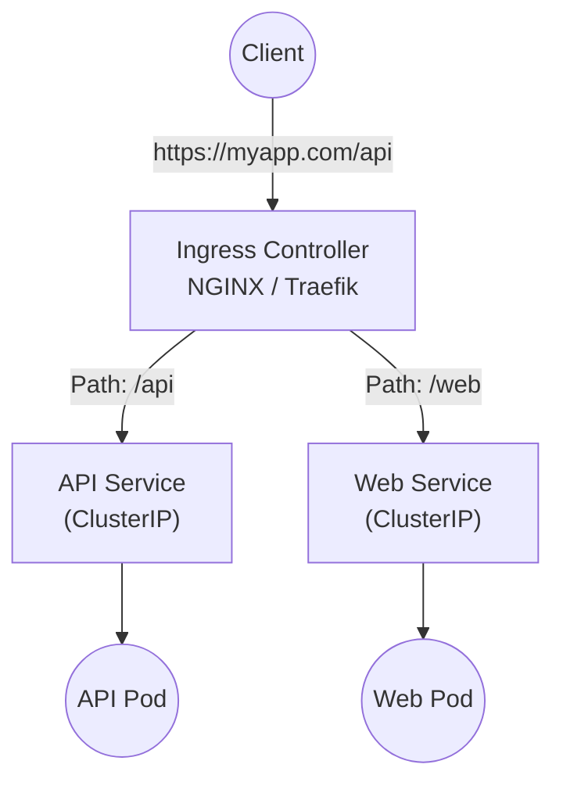
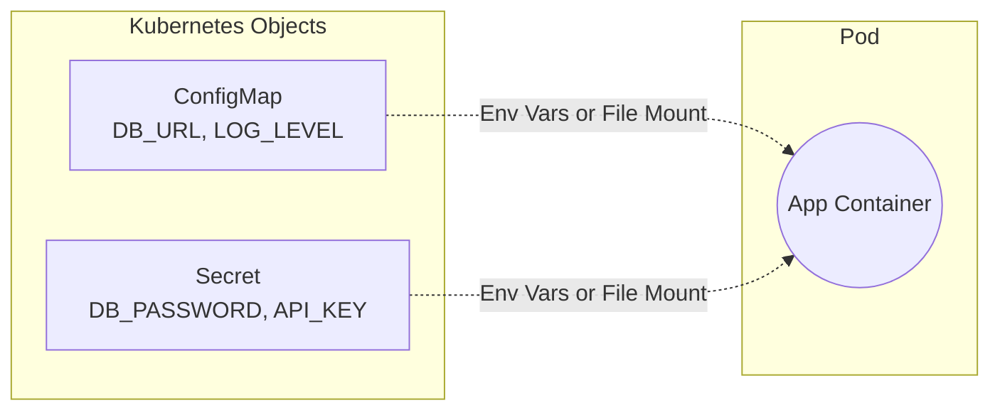

# ☸️ Complete Kubernetes Beginner-to-Advanced Guide

> **Welcome to Kubernetes!** This guide is designed to take you from zero to confident practitioner based on CNCF standards. Every concept is broken down with architectural explanations, component breakdowns, and essential commands.

---

## 📌 Table of Contents
1. [💡 Core Concepts & Introduction](#-1-core-concepts--introduction)
2. [🏛️ Phase 1: Kubernetes Architecture](#-phase-1-kubernetes-architecture)
3. [📦 Phase 2: Core Kubernetes Objects](#-phase-2-core-kubernetes-objects)
4. [🌐 Phase 3: Services & Networking](#-phase-3-services--networking)
5. [⚙️ Phase 4: Storage, Configs & Security](#-phase-4-storage-configs--security)
6. [🔄 Phase 5: Advanced Operations & Scaling](#-phase-5-advanced-operations--scaling)
7. [📋 Quick Command Reference Table](#-quick-command-reference-table)

---

## 💡 1. Core Concepts & Introduction

### ☁️ Linux Foundation & CNCF
- **Linux Foundation:** Created in 2000. Partnered with Google (who introduced Borg in April 2015) to create the CNCF.
- **Cloud Native Computing Foundation (CNCF):** Formed to open-source Kubernetes and drive containerization technologies like microservices and orchestration.
- **Project Categories:**
  - **Graduated:** Stable and widely adopted in production.
  - **Incubating:** Successfully used in production by a small user base.
  - **Sandbox:** Experimental or R&D phase.
  - **Archived:** Inactive / End of life cycle.

### ☸️ What is Kubernetes?
Kubernetes (K8s) is an open-source container orchestration platform that automates deployment, scaling, and management of containerized applications.

**Main Benefits:**
1. Hides resource management and failure handling from users.
2. Reliably operates applications with high availability.
3. Runs workloads across hundreds to thousands of machines.

**Managed K8s Services & Alternatives:**
- *Alternatives:* Docker Swarm, Marathon, Nomad.
- *Managed Services:* GKE (Google), AKS (Azure), EKS (Amazon), OCP (Red Hat OpenShift).

---

## 🏛️ Phase 1: Kubernetes Architecture

Kubernetes clusters follow a Master-Worker architecture.



### 🧠 Master Node (Control Plane) Components
Manages the overall cluster and its state.

- **Kube-API Server:** The front-end and central control plane component. Processes REST API requests and handles authentication/authorization.
- **Etcd:** A highly available key-value store for all cluster data. Acts as the **single source of truth** (needs regular backups!).
- **Kube-Scheduler:** Schedules Pods to suitable nodes considering CPU, memory, affinity/anti-affinity, and node taints.
- **Kube-Controller-Manager:** Ensures the actual state matches the desired state. Includes:
  - Node Controller (health)
  - Replication Controller (Pod count)
  - Endpoints Controller
  - Service Account & Token Controllers
- **Cloud Controller Manager:** Integrates with cloud provider APIs (AWS, Azure, GCP) for load balancers and storage.

### 🖥️ Worker Node Components
Hosts containers and is controlled by the master node.

- **Kubelet:** The primary "captain" agent running on each worker node. It registers the node with the cluster, listens for instructions from the Kube-API Server, and ensures that the containers described in PodSpecs are actually running and healthy. **(This is the most critical worker component!)**
- **Kube Proxy:** Maintains network rules on nodes. These rules allow network communication to your Pods from network sessions inside or outside of your cluster.
- **Container Runtime:** The underlying software responsible for actually pulling images and running containers (e.g., containerd, CRI-O, Docker).
- **Container Runtime Interface (CRI):** The standardized communication interface between the Kubelet and the Container Runtime.

---

## 📦 Phase 2: Core Kubernetes Objects

### 1️⃣ Pod
The **smallest deployable unit** in Kubernetes. A Pod wraps one or more containers that share networking and storage.


> 💡 Containers inside the same Pod communicate over `localhost` and share the same IP address.

**Useful Commands:**
```bash
kubectl get pods
kubectl describe pod <pod-name>
kubectl logs <pod-name>
kubectl exec -it <pod-name> -- /bin/sh
```

---

### 2️⃣ ReplicaSet
Ensures a **specified number of identical Pod replicas** are running at all times. If a Pod crashes, ReplicaSet creates a replacement.


> 💡 You rarely create ReplicaSets directly — **Deployments** manage them for you.

**Useful Commands:**
```bash
kubectl get rs
kubectl describe rs <rs-name>
kubectl scale rs <rs-name> --replicas=<num>
```

---

### 3️⃣ Deployment
Manages **stateless applications**. Creates and controls ReplicaSets, and enables **rolling updates** and **rollbacks**.


> 💡 During a rolling update, Pods in v1 are gradually replaced by v2 with **zero downtime**.

**Useful Commands:**
```bash
kubectl get deployments
kubectl rollout status deployment/<name>
kubectl rollout history deployment/<name>
kubectl rollout undo deployment/<name>
```

---

### 4️⃣ StatefulSet
Manages **stateful applications** that need **stable network identity** and **persistent storage** (e.g., databases).


> 💡 Each Pod gets a **predictable name** (`db-0`, `db-1`, `db-2`) and its **own persistent volume** that survives restarts.

**Useful Commands:**
```bash
kubectl get sts
kubectl describe sts <sts-name>
```

---

### 5️⃣ DaemonSet
Ensures **one copy of a Pod runs on every node** (or a subset). Perfect for cluster-wide agents.


> 💡 When a new node joins the cluster, the DaemonSet **automatically** schedules a Pod on it.

**Useful Commands:**
```bash
kubectl get ds
kubectl describe ds <ds-name>
```

---

### 6️⃣ Service
Provides a **stable IP address and DNS name** to access a group of Pods. Pods may come and go, but the Service endpoint stays constant.


> 💡 The Service **load-balances** traffic across healthy Pods. If a Pod dies and is replaced, the Service routes to the new Pod automatically.

**Useful Commands:**
```bash
kubectl get svc
kubectl describe svc <svc-name>
```

---

## 🌐 Phase 3: Services & Networking

How do you expose your apps inside and outside the cluster? 



### 1️⃣ Services Publishing Mechanisms
1. **ClusterIP (Default):** Exposes the service on a virtual IP within the cluster. Not accessible from outside. Used for internal communication (e.g., Backend to DB).
2. **NodePort:** Exposes the service on a static port (30000–32767) on each worker node's IP. Accessed via `http://<NodeIP>:<NodePort>`.
3. **LoadBalancer:** Automatically provisions a cloud provider's external load balancer (AWS ELB, GCP Load Balancer) to route external traffic to your Pods.
4. **Ingress:** Advanced routing for HTTP/HTTPS traffic. Works with a controller (NGINX/Traefik) to route traffic based on host or path rules.

### 2️⃣ Cluster DNS (Optional Add-On)
Provides DNS names for Services and Pods.
- Users interact with the Kube-API Server.
- Kube-Scheduler assigns Pods to nodes.
- Controllers constantly monitor and reconcile the state.

### 3️⃣ Ingress (HTTP/HTTPS Routing)
Ingress exposes HTTP and HTTPS routes from outside the cluster to services within the cluster. Traffic routing is controlled by rules defined on the Ingress resource.


> 💡 An Ingress controller is required to satisfy an Ingress. Only creating an Ingress resource has no effect.

**Useful Commands:**
```bash
kubectl get ingress
kubectl describe ingress <ingress-name>
```

---

## ⚙️ Phase 4: Storage, Configs & Security

### 💾 Volumes
Containers are ephemeral. Volumes allow Pods to access persistent storage, local storage, or cloud storage to ensure data survives container restarts.

### 🔐 ConfigMaps and Secrets
- **ConfigMap:** Stores non-confidential configuration data in key-value pairs. Can be injected as environment variables or mounted as config files.
- **Secrets:** Stores sensitive data (passwords, OAuth tokens, SSH keys). Data is base64 **encoded**, not encrypted by default (unless ETCD encryption is enabled).


> 💡 Decoupling configuration from image content keeps containerized applications portable.

**Useful Commands:**
```bash
kubectl get configmaps
kubectl get secrets
kubectl describe configmap <cm-name>
kubectl get secret <secret-name> -o yaml
```

### 🏢 Namespaces
Divides cluster resources between multiple teams or apps:
- `default`: Used if no namespace is specified.
- `kube-public`: Open to everyone (don't put apps here!).
- `kube-node-lease`: Stores node heartbeat objects.
- `kube-system`: Reserved for Kubernetes internal objects.

---

## 🔄 Phase 5: Advanced Operations & Scaling

### 1️⃣ What is KUBECONFIG?
A config file stored in `$HOME/.kube/config` that `kubectl` uses to communicate with the cluster.
- **clusters:** Lists K8s clusters (e.g., Minikube, EKS).
- **users:** User credentials and keys.
- **contexts:** Groups a cluster and a user to easily switch environments.

### 2️⃣ Scaling & Deployment Strategies
**Manual Scaling:** 
```bash
kubectl scale deployment hello-world --replicas=6
```

**Horizontal Pod Autoscaler (HPA):**
Automatically scales the number of Pods in a replication controller, deployment, or stateful set based on observed CPU utilization (or other custom metrics).

```mermaid
graph LR
  MetricsServer[Metrics Server\n(Observes CPU 85%)] --> HPA[HPA Controller]
  HPA -->|Target CPU: 50%| DEP[Deployment]
  DEP -.->|Scales Up| P1((Pod 1))
  DEP -.->|Scales Up| P2((Pod 2))
  DEP -.->|Scales Up| P3((Pod 3))
```

**Deployment Strategies:**
How to deploy new versions of an application.

1. **Rolling Update (Default):** Replaces old Pods with new ones incrementally with **Zero Downtime**.
   - `maxUnavailable`: Max # of Pods that can be unavailable.
   - `maxSurge`: Max # of Pods created above the limit.
   ```mermaid
   graph LR
     v1[v1 Pods] -.->|Slowly Terminate| X(Old Version)
     Y(New Version) -.->|Incrementally Start| v2[v2 Pods]
   ```

2. **Blue-Green:** Deploy the new version (Green) alongside the old one (Blue). Switch traffic all at once via the Service when Green is ready. Fast rollback.
   ```mermaid
   graph TD
     SVC[Service] -.->|Switch Traffic| Blue[Blue: v1\nIdle]
     SVC -->|Active Traffic| Green[Green: v2\nActive]
   ```

3. **Canary:** Route a small percentage of traffic to the new version to test it before a full rollout.
   ```mermaid
   graph LR
     Client((Client)) --> SVC[Service / Ingress]
     SVC -->|90% Traffic| v1[Stable v1]
     SVC -->|10% Traffic| v2[Canary v2]
   ```

### 3️⃣ Advanced Pod Features
- **Init Container:** Runs initialization tasks (like waiting for a database to be ready) *before* the main container starts.
- **Liveness Probe:** A self-healing mechanism that automatically restarts a container if it becomes unresponsive or fails health checks.
- **Multi-Container Pod:** Running two containers side-by-side in the same Pod for collaborative workloads.

### 4️⃣ Resource Requests vs Limits
Kubernetes uses requests and limits to manage CPU and memory resources for containers.

- **Requests:** The minimum amount of CPU/Memory guaranteed for a container. The Kube-Scheduler uses this to decide which node to place the Pod on.
- **Limits:** The maximum amount of CPU/Memory a container is allowed to use. 

```mermaid
graph TD
  subgraph Node Capacity: 4 CPU, 16GB RAM
    subgraph Container
      R["Request\n(Guaranteed: 1 CPU, 1GB)"]
      L["Limit\n(Max: 2 CPU, 2GB)"]
      R --- L
    end
  end
  
  L -.->|Exceeds CPU Limit| CPU_Throttle["CPU Throttled\n(App slows down)"]
  L -.->|Exceeds Memory Limit| OOM_Kill["OOMKilled\n(Pod crashes/restarts)"]
```
> 💡 **OOMKilled** (Out Of Memory Killed) happens when a container tries to use more memory than its limit. CPU limits only cause throttling, not crashes.

---

## 📋 Quick Command Reference Table

| Task | Command |
| :--- | :--- |
| **Get All Pods** | `kubectl get pods` |
| **Get ReplicaSets** | `kubectl get rs` |
| **Get Services** | `kubectl get svc` |
| **Describe Object** | `kubectl describe svc <service-name>` |
| **Scale Deployment** | `kubectl scale deployment <name> --replicas=<num>` |
| **View Kubeconfig** | `kubectl config view` |
| **Check Current Context**| `kubectl config current-context` |
| **Set Context** | `kubectl config use-context <CONTEXT_NAME>` |
| **List All Contexts** | `kubectl config get-contexts` |
| **View System Events** | `kubectl get events -n kube-system` |

---
> 💡 **DevOps Tip:** Always double-check your `current-context` before running destructive commands to ensure you aren't accidentally affecting the production cluster!
