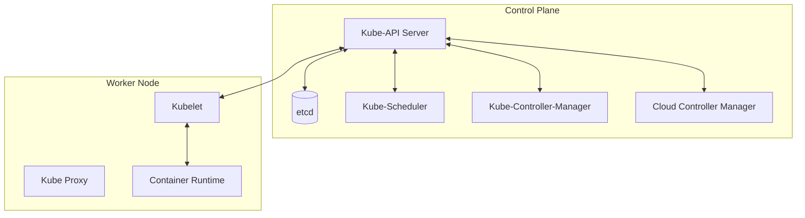
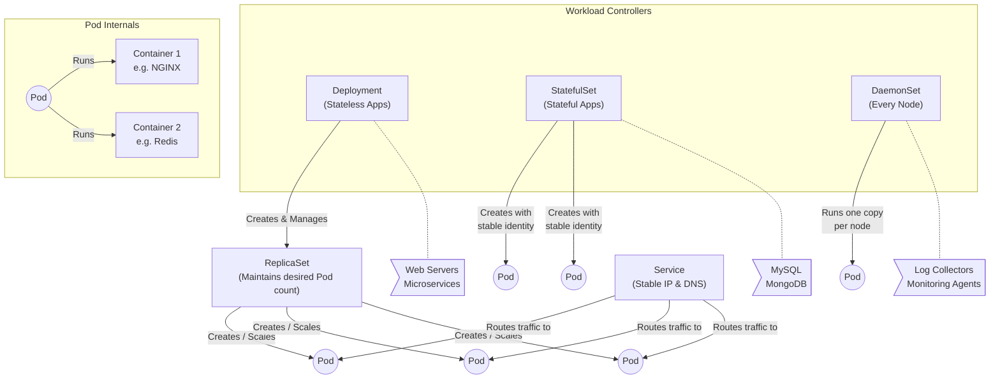
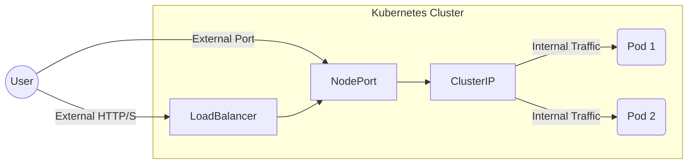

# ☸️ Complete Kubernetes Beginner-to-Advanced Guide

> **Welcome to Kubernetes!** This guide is designed to take you from zero to confident practitioner based on CNCF standards. Every concept is broken down with architectural explanations, component breakdowns, and essential commands.

---

## 📌 Table of Contents
1. [💡 Core Concepts & Introduction](#-1-core-concepts--introduction)
2. [🏛️ Phase 1: Kubernetes Architecture](#-phase-1-kubernetes-architecture)
3. [📦 Phase 2: Core Kubernetes Objects](#-phase-2-core-kubernetes-objects)
4. [🌐 Phase 3: Services & Networking](#-phase-3-services--networking)
5. [⚙️ Phase 4: Storage, Configs & Security](#-phase-4-storage-configs--security)
6. [🔄 Phase 5: Advanced Operations & Scaling](#-phase-5-advanced-operations--scaling)
7. [📋 Quick Command Reference Table](#-quick-command-reference-table)

---

## 💡 1. Core Concepts & Introduction

### ☁️ Linux Foundation & CNCF
- **Linux Foundation:** Created in 2000. Partnered with Google (who introduced Borg in April 2015) to create the CNCF.
- **Cloud Native Computing Foundation (CNCF):** Formed to open-source Kubernetes and drive containerization technologies like microservices and orchestration.
- **Project Categories:**
  - **Graduated:** Stable and widely adopted in production.
  - **Incubating:** Successfully used in production by a small user base.
  - **Sandbox:** Experimental or R&D phase.
  - **Archived:** Inactive / End of life cycle.

### ☸️ What is Kubernetes?
Kubernetes (K8s) is an open-source container orchestration platform that automates deployment, scaling, and management of containerized applications.

**Main Benefits:**
1. Hides resource management and failure handling from users.
2. Reliably operates applications with high availability.
3. Runs workloads across hundreds to thousands of machines.

**Managed K8s Services & Alternatives:**
- *Alternatives:* Docker Swarm, Marathon, Nomad.
- *Managed Services:* GKE (Google), AKS (Azure), EKS (Amazon), OCP (Red Hat OpenShift).

---

## 🏛️ Phase 1: Kubernetes Architecture

Kubernetes clusters follow a Master-Worker architecture.



### 🧠 Master Node (Control Plane) Components
Manages the overall cluster and its state.

- **Kube-API Server:** The front-end and central control plane component. Processes REST API requests and handles authentication/authorization.
- **Etcd:** A highly available key-value store for all cluster data. Acts as the **single source of truth** (needs regular backups!).
- **Kube-Scheduler:** Schedules Pods to suitable nodes considering CPU, memory, affinity/anti-affinity, and node taints.
- **Kube-Controller-Manager:** Ensures the actual state matches the desired state. Includes:
  - Node Controller (health)
  - Replication Controller (Pod count)
  - Endpoints Controller
  - Service Account & Token Controllers
- **Cloud Controller Manager:** Integrates with cloud provider APIs (AWS, Azure, GCP) for load balancers and storage.

### 🖥️ Worker Node Components
Hosts containers and is controlled by the master node.

- **Kubelet:** The primary agent running on each node that communicates with the master.
- **Kube Proxy:** Maintains network rules on nodes for communication.
- **Container Runtime:** Software that creates and runs containers (Docker, containerd, CRI-O).
- **Container Runtime Interface (CRI):** Communication interface between kubelet and runtimes (Allows flexibility using CRI shims).

---

## 📦 Phase 2: Core Kubernetes Objects



| Object | Purpose | Use Case |
| :--- | :--- | :--- |
| **Pod** | Smallest K8s object. Represents a single instance of a running process. | Can have single or multi-containers (e.g., NGINX + Redis). |
| **ReplicaSet** | Ensures a specified number of Pod replicas are running. | Used by Deployments. |
| **Deployment** | Manages the deployment and scaling of Pods. | Web servers, microservices. |
| **StatefulSet** | Manages stateful apps with stable identities and persistent storage. | Databases (MySQL, MongoDB). |
| **DaemonSet** | Ensures a copy of a Pod runs on all (or some) nodes. | Log collection, monitoring agents. |
| **Service** | Provides a stable IP and DNS name to access Pods. | Internal/external traffic routing. |

---

## 🌐 Phase 3: Services & Networking

How do you expose your apps inside and outside the cluster? 



### 1️⃣ Services Publishing Mechanisms
1. **ClusterIP (Default):** Exposes the service on a virtual IP within the cluster. Not accessible from outside. Used for internal communication (e.g., Backend to DB).
2. **NodePort:** Exposes the service on a static port (30000–32767) on each worker node's IP. Accessed via `http://<NodeIP>:<NodePort>`.
3. **LoadBalancer:** Automatically provisions a cloud provider's external load balancer (AWS ELB, GCP Load Balancer) to route external traffic to your Pods.
4. **Ingress:** Advanced routing for HTTP/HTTPS traffic. Works with a controller (NGINX/Traefik) to route traffic based on host or path rules.

### 2️⃣ Cluster DNS (Optional Add-On)
Provides DNS names for Services and Pods.
- Users interact with the Kube-API Server.
- Kube-Scheduler assigns Pods to nodes.
- Controllers constantly monitor and reconcile the state.

---

## ⚙️ Phase 4: Storage, Configs & Security

### 💾 Volumes
Containers are ephemeral. Volumes allow Pods to access persistent storage, local storage, or cloud storage to ensure data survives container restarts.

### 🔐 ConfigMaps and Secrets
- **ConfigMap:** Stores configuration data in key-value pairs (injected as env vars or config files).
- **Secrets:** Similar to ConfigMap but stores sensitive data (passwords, OAuth tokens, SSH keys). Data is **encoded**, not encrypted by default.

### 🏢 Namespaces
Divides cluster resources between multiple teams or apps:
- `default`: Used if no namespace is specified.
- `kube-public`: Open to everyone (don't put apps here!).
- `kube-node-lease`: Stores node heartbeat objects.
- `kube-system`: Reserved for Kubernetes internal objects.

---

## 🔄 Phase 5: Advanced Operations & Scaling

### 1️⃣ What is KUBECONFIG?
A config file stored in `$HOME/.kube/config` that `kubectl` uses to communicate with the cluster.
- **clusters:** Lists K8s clusters (e.g., Minikube, EKS).
- **users:** User credentials and keys.
- **contexts:** Groups a cluster and a user to easily switch environments.

### 2️⃣ Scaling & Rolling Updates
**Scaling:** 
```bash
kubectl scale deployment hello-world --replicas=6
```

**Rolling Update:** A strategy to replace old Pods with new ones incrementally with **Zero Downtime**.
- `maxUnavailable`: Max # of Pods that can be unavailable during update.
- `maxSurge`: Max # of Pods that can be created above the desired limit.

### 3️⃣ Advanced Pod Features
- **Init Container:** Runs initialization tasks (like waiting for a database to be ready) *before* the main container starts.
- **Liveness Probe:** A self-healing mechanism that automatically restarts a container if it becomes unresponsive or fails health checks.
- **Multi-Container Pod:** Running two containers side-by-side in the same Pod for collaborative workloads.

---

## 📋 Quick Command Reference Table

| Task | Command |
| :--- | :--- |
| **Get All Pods** | `kubectl get pods` |
| **Get ReplicaSets** | `kubectl get rs` |
| **Get Services** | `kubectl get svc` |
| **Describe Object** | `kubectl describe svc <service-name>` |
| **Scale Deployment** | `kubectl scale deployment <name> --replicas=<num>` |
| **View Kubeconfig** | `kubectl config view` |
| **Check Current Context**| `kubectl config current-context` |
| **Set Context** | `kubectl config use-context <CONTEXT_NAME>` |
| **List All Contexts** | `kubectl config get-contexts` |
| **View System Events** | `kubectl get events -n kube-system` |

---
> 💡 **DevOps Tip:** Always double-check your `current-context` before running destructive commands to ensure you aren't accidentally affecting the production cluster!
